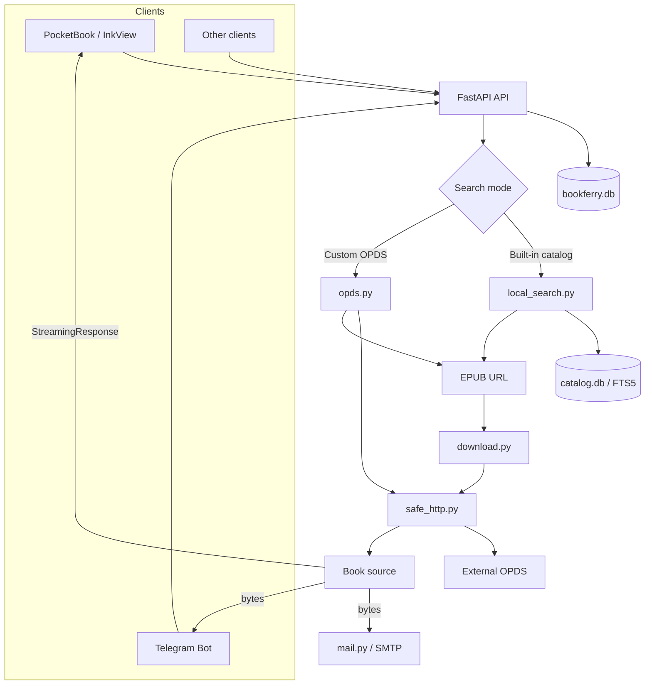
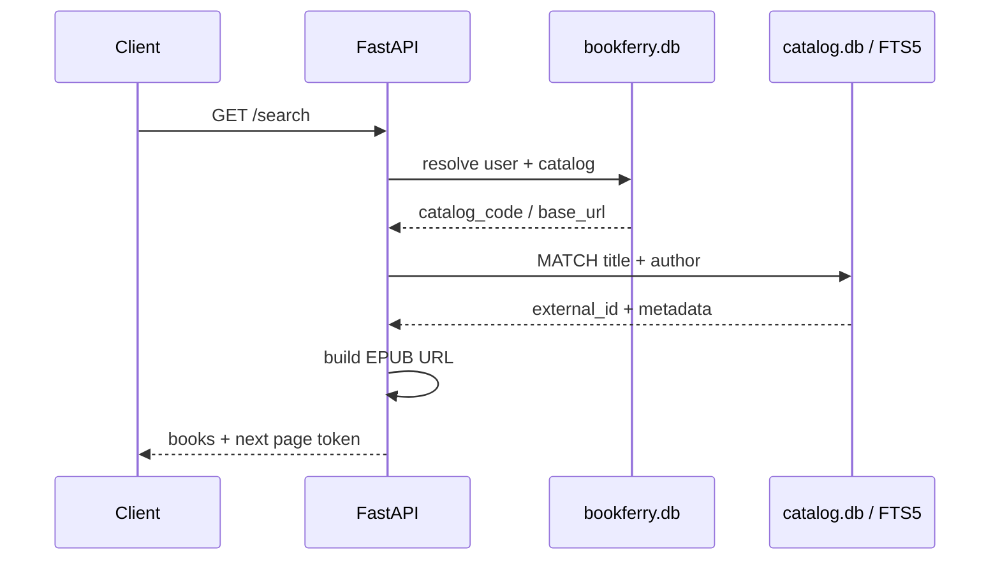
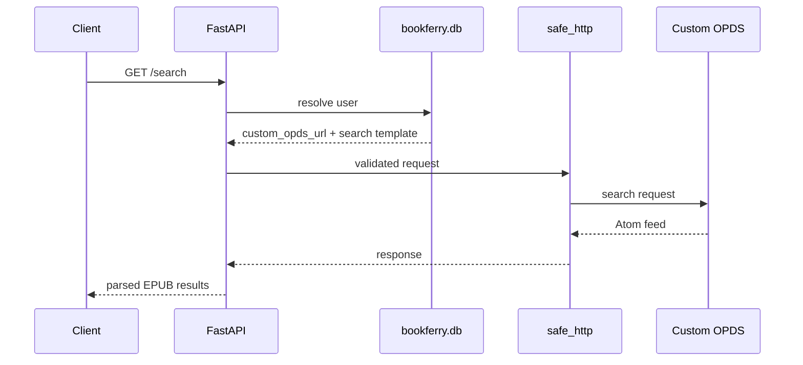
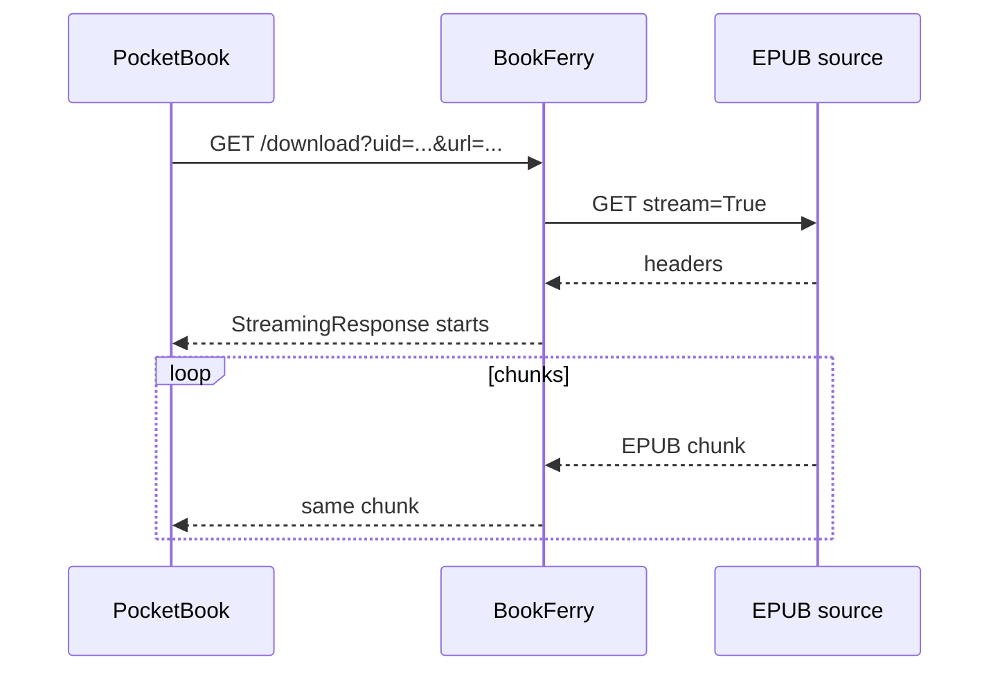
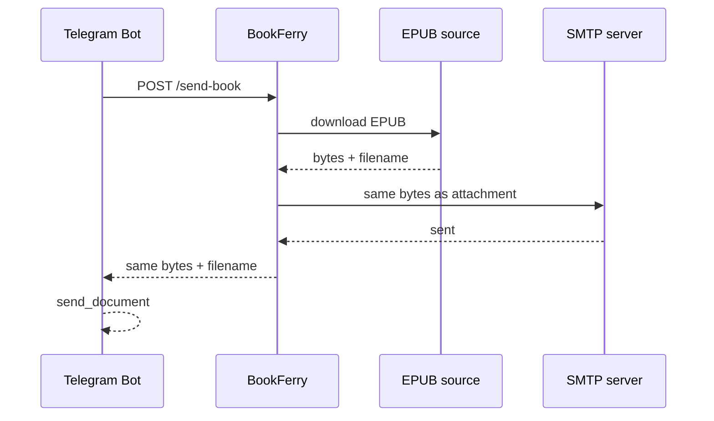

# BookFerry Architecture

Этот документ описывает текущую архитектуру BookFerry Server и взаимодействие с клиентами.

README отвечает на вопрос «что умеет проект и как его запустить». Здесь описано, **почему система устроена именно так и как проходят основные потоки данных**.

## 1. Цели архитектуры

BookFerry решает три разные задачи:

1. быстро искать книги;
2. получать EPUB у внешнего источника только по запросу;
3. доставлять книгу разным клиентам без дублирования backend-логики.

Из этого следуют основные принципы:

- метаданные и пользовательские данные хранятся отдельно;
- встроенные каталоги ищутся локально;
- EPUB-файлы не образуют постоянное серверное хранилище;
- пользовательский OPDS считается недоверенным внешним вводом;
- обновление большого книжного индекса не должно повреждать рабочую базу;
- API по возможности общий для всех клиентов;
- специфичный формат ответа используется только там, где этого требует простой PocketBook-клиент.

## 2. Общая схема



## 3. Компоненты

### `main.py`

Минимальная точка входа:

- настраивает логирование;
- инициализирует обе SQLite-базы;
- создаёт FastAPI;
- подключает request logging middleware;
- подключает API router.

Бизнес-логика здесь не хранится.

### `app/api.py`

HTTP boundary приложения.

Отвечает за:

- идентификацию пользователя;
- выбор нужного search flow;
- преобразование ошибок сервисов в HTTP ошибки;
- выбор download flow для конкретного типа клиента;
- compatibility endpoints;
- API-level logging.

### `app/services/local_search.py`

Адаптер встроенных каталогов.

Отвечает за:

- преобразование пользовательского запроса в FTS5 query;
- локальный поиск по `catalog.db`;
- пагинацию;
- построение EPUB URL из `catalog_code` и `external_id`.

### `app/services/opds.py`

Generic OPDS 1.x / OpenSearch client.

Используется только для персонального custom OPDS.

Отвечает за:

- проверку Atom feed;
- обнаружение `rel="search"`;
- чтение OpenSearch Description;
- заполнение `{searchTerms}`;
- разбор EPUB acquisition links;
- OPDS pagination.

### `app/services/safe_http.py`

Единая точка сетевой защиты для URL, контролируемых пользователем или внешним каталогом.

Отвечает за:

- проверку схемы;
- DNS resolution;
- запрет non-global IP;
- запрет credentials в URL;
- ручное прохождение redirect с повторной валидацией каждого адреса.

### `app/services/download.py`

Скачивание выбранного EPUB.

Содержит две операции:

- обычная загрузка книги целиком в память;
- открытие upstream streaming response для PocketBook.

Файл на диск здесь не создаётся.

### `app/services/mail.py`

Формирует письмо с EPUB-вложением и отправляет его через SMTP.

Получает уже готовые `bytes` и `filename`, поэтому не зависит от временных файлов.

## 4. Хранилища данных

BookFerry использует две независимые SQLite-базы.

### 4.1 `bookferry.db`

Постоянное пользовательское состояние.

Основные таблицы:

```text
users
catalogs
```

Основные поля `users`:

```text
id
uid
client_type
external_id
catalog_id
custom_opds_url
custom_opds_search_template
emails
subject
created_at
last_seen_at
```

`uid` — основной client-neutral identifier.

`external_id` используется там, где у внешнего клиента уже есть естественный ID. Для Telegram это Telegram user ID.

`last_seen_at` обновляется при пользовательской активности и позволяет отличать реальные активные установки от старых записей.

### 4.2 `catalog.db`

Перестраиваемый индекс метаданных книг.

Таблицы:

```text
books
books_fts
```

`books` хранит:

```text
catalog_code
external_id
title
author
language
```

EPUB URL и сами файлы книг здесь не хранятся.

### Почему базы разделены

`bookferry.db` содержит ценное состояние пользователей и не должна заменяться при обновлении книг.

`catalog.db` является производным индексом. Его можно полностью построить заново из внешних источников.

Таким образом nightly rebuild не затрагивает пользовательские данные.

## 5. Built-in search flow



Встроенный поиск не делает HTTP-запрос к Flibusta, Gutenberg или AmuseWiki.

Это даёт:

- стабильную скорость поиска;
- отсутствие зависимости search latency от внешнего OPDS;
- контролируемую пагинацию;
- меньшую нагрузку на внешние каталоги.

### FTS query

Пользовательский запрос разбивается на слова. Каждое слово используется как prefix term.

Например:

```text
лабиринт лукьян
```

становится логически эквивалентным:

```text
"лабиринт"* AND "лукьян"*
```

FTS индексирует одновременно `title` и `author`.

### Pagination

Размер страницы — 20 результатов.

Для локального поиска клиент получает внутренний token:

```text
local:20
local:40
```

Клиент не должен интерпретировать его структуру — только вернуть backend в следующем запросе.

## 6. Custom OPDS search flow



Custom OPDS принципиально не импортируется в общий `catalog.db`.

Причины:

- это персональная настройка пользователя;
- источник заранее неизвестен;
- импорт чужого каталога может быть слишком большим;
- backend не должен превращать пользовательский URL в глобальную конфигурацию системы.

При выборе любого встроенного `catalog_id` поля custom OPDS очищаются, после чего поиск снова становится локальным.

## 7. Download flow

После поиска клиент получает EPUB URL. Перед скачиванием этот URL снова проходит `safe_http` validation.

У PocketBook и Telegram разные transport requirements, поэтому после общей части flow расходится.

### 7.1 PocketBook streaming



PocketBook не должен ждать, пока BookFerry сначала полностью скачает книгу.

Backend:

1. открывает upstream response;
2. получает исходное имя файла и `Content-Length`, если он доступен;
3. создаёт `StreamingResponse`;
4. проксирует данные chunks по 64 KiB;
5. закрывает upstream response после завершения.

Логи разделяют:

- время до готовности upstream response;
- полную длительность передачи;
- число переданных байт.

### 7.2 Telegram + e-mail



Для этого flow книга загружается в память один раз.

Те же байты используются:

- для SMTP-вложения;
- для HTTP-ответа Telegram-боту.

Временного EPUB на общем filesystem нет.

Это важно не только как упрощение. Ранее два параллельных запроса одной книги использовали одинаковый путь `Temp/<filename>`, и один запрос мог удалить файл другого. In-memory flow устраняет этот класс race condition полностью.

## 8. Имена файлов

Backend не генерирует пользовательское имя книги.

Порядок определения имени:

1. `Content-Disposition` источника;
2. basename конечного URL после redirect;
3. если имя определить невозможно — ошибка.

Имя не дополняется автоматически `.epub` и не заменяется искусственным UUID.

PocketBook при сохранении на устройство формирует локальное имя из автора и названия книги, потому что это уже UI/reader concern.

## 9. User identity и compatibility API

Основная модель пользователя client-neutral:

```text
uid + client_type
```

Поддерживаемые значения `client_type`:

```text
telegram
pocketbook
flutter
```

Наличие `flutter` в модели означает зарезервированный тип клиента; отдельный Flutter client в текущем репозитории не реализован.

### PocketBook

При первом запуске получает UUID через `/users/register` и хранит его локально.

### Telegram

Для существующего бота сохраняются endpoints по `telegram_id` и старые POST-варианты `/search` и `/send-book`.

Новая общая логика поиска и скачивания при этом находится в тех же backend-функциях, а compatibility endpoint только адаптирует входной контракт.

## 10. PocketBook plain protocol

PocketBook SDK удобно работает через `QuickDownload()`, поэтому для ряда общих GET endpoints поддерживается `plain=1`.

Пример search response:

```text
COUNT	20
BOOK	<title>	<author>	<url>
BOOK	<title>	<author>	<url>
NEXT	<page_token>
```

Строковые значения percent-encoded.

Это не отдельный PocketBook API, а альтернативное представление того же ресурса.

## 11. SSRF protection

Custom OPDS и URL книги могут указывать на произвольный внешний адрес, поэтому обычный `requests.get()` напрямую из API не используется.

`safe_http.py` запрещает:

- схемы кроме HTTP/HTTPS;
- URL credentials;
- loopback;
- private address ranges;
- link-local;
- прочие non-global IP.

DNS разрешается до запроса. Redirect автоматически не следует: каждый новый `Location` проходит ту же валидацию.

Ограничено количество redirect.

## 12. Catalog update architecture

Книжный индекс не обновляется по месту.

### Full update

```text
external sources
       ↓
new temporary catalog database
       ↓
import all built-in catalogs
       ↓
minimum count validation
       ↓
PRAGMA integrity_check
       ↓
FTS rebuild + ANALYZE
       ↓
atomic os.replace()
       ↓
new catalog.db
```

Пока новый snapshot не прошёл все проверки, production продолжает использовать старый `catalog.db`.

### Protection against incomplete source data

Updater проверяет минимальное количество записей по каждому каталогу. Это защищает от ситуации, когда внешний источник временно вернул пустой или сильно урезанный dataset.

### Concurrent updater protection

`fcntl.flock()` не позволяет запустить второй full update одновременно с уже работающим.

### Scheduling

В production updater запускается systemd timer каждый день в `03:00 Asia/Almaty`.

## 13. Logging and observability

Request middleware назначает каждому запросу `request_id`.

Если клиент передал безопасный `X-Request-ID`, он используется для корреляции между клиентом и backend. Иначе backend создаёт свой ID.

Логи разделены по смыслу:

```text
bookferry.access
bookferry.api
```

Основные business events:

```text
SEARCH
SEARCH_RESULT
SEARCH_ERROR
DOWNLOAD
DOWNLOAD_STREAM_READY
DOWNLOAD_RESULT
DOWNLOAD_ERROR
USER_REGISTERED
PROFILE_READ
CATALOG_CHANGED
CUSTOM_OPDS_CHANGED
EMAILS_CHANGED
SUBJECT_CHANGED
```

`request_id` позволяет связать HTTP access log и business log одного запроса.

## 14. Schema evolution

`init_db()` создаёт таблицы для новой установки и проверяет необходимые колонки существующей `users` table.

Новые nullable columns, появившиеся в ходе развития проекта, добавляются при старте приложения через `ALTER TABLE` только если их ещё нет.

Это сохраняет простую SQLite-схему без отдельного migration framework для небольшого проекта.

## 15. Module boundaries

```text
main.py
    application bootstrap

app/api.py
    HTTP boundary, orchestration, compatibility endpoints

app/models.py
    request/response models

app/config.py
    environment configuration

app/logging_config.py
    request ID and application logging

app/db/database.py
    users/catalogs database schema

app/db/users.py
    user persistence

app/db/catalogs.py
    built-in catalog configuration access

app/db/catalog_database.py
    books + FTS schema

app/services/local_search.py
    local metadata search and source URL adapters

app/services/opds.py
    custom OPDS/OpenSearch protocol

app/services/safe_http.py
    validated external HTTP access

app/services/download.py
    EPUB download and streaming

app/services/mail.py
    SMTP delivery

scripts/import_*.py
    metadata source adapters/importers

scripts/update_all_catalogs.py
    production full catalog rebuild

pocketbook/main.c
    PocketBook UI and API client
```

## 16. Architectural invariants

При дальнейшей разработке важно сохранять несколько правил.

### Built-in search remains local

Нельзя возвращать встроенные каталоги к сетевому поиску на каждый запрос пользователя без отдельной причины.

### User DB and catalog DB remain separate

`bookferry.db` — состояние пользователей.

`catalog.db` — disposable derived index.

### EPUB is downloaded on demand

Backend не является постоянным файловым зеркалом книжных источников.

### Custom URL is untrusted input

Любой custom OPDS URL, redirect и book URL должен проходить `safe_http`.

### Catalog rebuild is atomic

Большой импорт не пишет прямо в рабочий `catalog.db`.

### Client-specific code stays at the edge

PocketBook plain responses и Telegram compatibility endpoints допустимы как адаптеры, но core search/download logic не должна дублироваться по клиентам.

### Do not reintroduce shared temporary EPUB paths

Если файл уже находится в памяти, нет причины записывать его в общий `Temp/<filename>` только для последующего чтения и удаления.

## 17. Known limitations

Текущее состояние проекта сознательно ограничено:

- EPUB only;
- OPDS 1.x / Atom / OpenSearch, без OPDS 2.0 JSON;
- полный pytest regression suite ещё не реализован;
- отдельный Flutter client пока отсутствует;
- SMTP отправляется синхронно в рамках Telegram download request.

Эти ограничения являются текущим scope проекта, а не скрытыми возможностями.