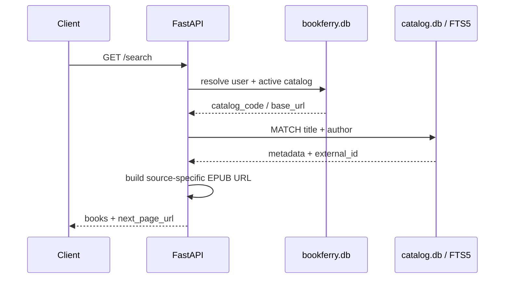
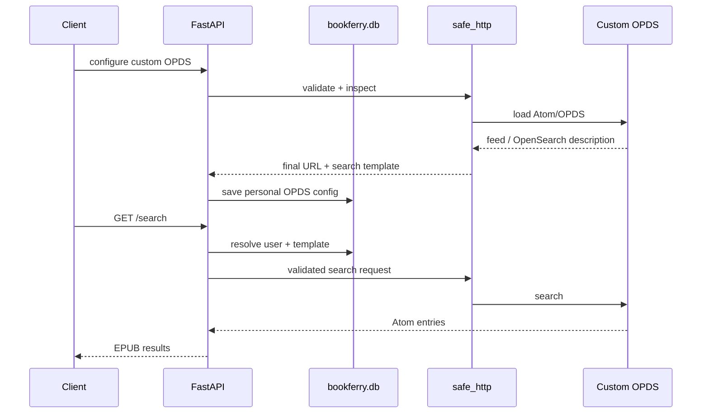
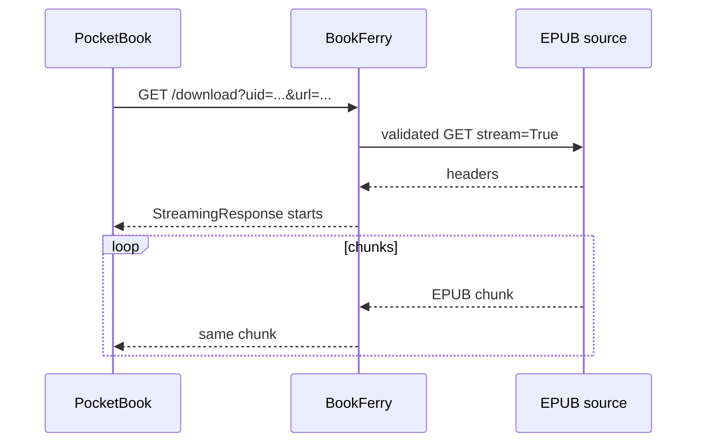
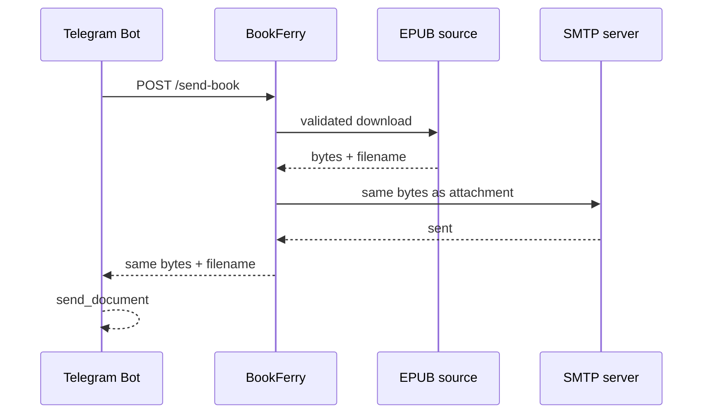

# BookFerry Architecture

Этот документ описывает текущую архитектуру BookFerry Server и взаимодействие с реальными клиентами.

README отвечает на вопрос «что умеет проект и как его запустить». Здесь зафиксированы **границы компонентов, потоки данных и архитектурные решения, которые важно не потерять при дальнейшем развитии**.

## 1. Цели архитектуры

BookFerry решает три основные задачи:

1. быстро искать книги;
2. получать EPUB у внешнего источника только после выбора книги пользователем;
3. доставлять книгу разным клиентам без дублирования core backend-логики.

Из этого следуют основные принципы:

- метаданные книг и пользовательские данные хранятся отдельно;
- встроенные каталоги ищутся локально;
- EPUB-файлы не образуют постоянное серверное хранилище;
- custom OPDS и внешние book URL считаются недоверенным вводом;
- большой индекс обновляется через отдельный snapshot и атомарную замену;
- общий API и сервисный слой используются всеми клиентами;
- client-specific контракты остаются тонкими адаптерами на HTTP boundary.

## 2. Общая схема


## 3. Основные компоненты

### `main.py`

Минимальный application bootstrap:

- настраивает logging;
- инициализирует `bookferry.db`;
- инициализирует схему `catalog.db`;
- создаёт FastAPI application;
- подключает request logging middleware;
- подключает API router.

Бизнес-логики здесь нет.

### `app/api.py`

HTTP boundary и orchestration layer.

Отвечает за:

- разрешение пользователя по `uid` или `telegram_id`;
- выбор built-in или custom OPDS search flow;
- преобразование ошибок сервисов в HTTP errors;
- выбор streaming или in-memory download flow;
- PocketBook plain responses;
- Telegram compatibility endpoints;
- API-level business logging.

### `app/services/local_search.py`

Адаптер локального поиска по встроенным каталогам.

Отвечает за:

- преобразование пользовательского запроса в FTS5 query;
- поиск в `catalog.db`;
- локальную пагинацию;
- построение source-specific EPUB URL из `catalog_code`, `base_url` и `external_id`.

### `app/services/opds.py`

Generic OPDS 1.x / Atom / OpenSearch client для персонального custom OPDS.

Отвечает за:

- inspection OPDS feed;
- обнаружение `rel="search"`;
- чтение OpenSearch Description;
- подстановку `{searchTerms}`;
- разбор EPUB acquisition links;
- сетевую OPDS pagination.

### `app/services/safe_http.py`

Единая точка сетевой защиты для URL, которые приходят от пользователя или внешнего каталога.

Отвечает за:

- разрешённые схемы;
- запрет URL credentials;
- DNS resolution;
- запрет loopback/private/link-local/non-global IP;
- ручное прохождение redirect;
- повторную валидацию каждого redirect target.

### `app/services/download.py`

Содержит две формы получения EPUB:

- `download_book()` — полный файл в память;
- `open_book_stream()` + `iter_book_stream()` — streaming для PocketBook.

Общие временные EPUB-файлы здесь не создаются.

### `app/services/mail.py`

Получает уже готовые `bytes`, имя файла и параметры письма, формирует EPUB attachment и отправляет его через SMTP.

Сервис не скачивает книги самостоятельно и не зависит от файловой системы.

## 4. Хранилища данных

BookFerry использует две независимые SQLite-базы.

### 4.1 `bookferry.db`

Постоянное пользовательское состояние.

Основные таблицы:

```text
users
catalogs
```

Ключевые поля `users`:

```text
id
uid
client_type
external_id
catalog_id
custom_opds_url
custom_opds_search_template
emails
subject
created_at
last_seen_at
```

`uid` — основной client-neutral identifier.

`external_id` используется там, где у клиента уже есть естественный внешний ID. Для Telegram это Telegram user ID.

Поддерживаемые `client_type`:

```text
telegram
pocketbook
flutter
```

`flutter` зарезервирован моделью пользователей, но Flutter client в этом репозитории пока не реализован.

`last_seen_at` обновляется при пользовательской активности и используется для статистики активности.

### 4.2 `catalog.db`

Производный перестраиваемый индекс метаданных.

Основные таблицы:

```text
books
books_fts
```

`books` хранит:

```text
catalog_code
external_id
title
author
language
```

EPUB URL и сами EPUB-файлы в базе не хранятся.

### Почему базы разделены

`bookferry.db` содержит пользовательское состояние, которое нельзя потерять при обновлении каталога.

`catalog.db` можно полностью восстановить из внешних источников, поэтому он обновляется как disposable snapshot.

Nightly rebuild книжного индекса не затрагивает пользователей.

## 5. Встроенные каталоги

В `bookferry.db` инициализируются четыре built-in source:

| `catalog_code` | Источник | Метаданные |
|---|---|---|
| `gutenberg` | Project Gutenberg | CSV |
| `anarchist` | The Anarchist Library | OPDS / AmuseWiki |
| `flibusta` | Flibusta | SQL dumps |
| `anarchist_ru` | Библиотека Анархизма | OPDS / AmuseWiki |

Их `base_url` используется при построении URL выбранной книги и при отображении конфигурации пользователю, но **поиск по встроенному каталогу выполняется только локально**.

## 6. Built-in search flow



Преимущества локального поиска:

- search latency не зависит от внешнего OPDS;
- одинаковое поведение для всех встроенных каталогов;
- контролируемая пагинация;
- внешние сайты не получают запрос на каждый пользовательский поиск;
- outage источника не мешает искать уже проиндексированные метаданные.

### FTS query

Пользовательский запрос разбивается на слова, каждое превращается в prefix term.

Например:

```text
лабиринт лукьян
```

логически превращается в:

```text
"лабиринт"* AND "лукьян"*
```

FTS одновременно индексирует `title` и `author`.

### Pagination

Размер страницы — 20 результатов.

Локальный search возвращает token вида:

```text
local:20
local:40
local:60
```

Клиент не должен интерпретировать token — только передать его обратно как `page_url` следующего запроса.

## 7. Custom OPDS flow



Custom OPDS не импортируется в общий `catalog.db`.

Причины:

- это персональная настройка;
- источник заранее неизвестен;
- пользовательский каталог может быть большим или нестандартным;
- один пользовательский URL не должен становиться глобальной конфигурацией сервиса.

При переключении обратно на built-in `catalog_id` поля `custom_opds_url` и `custom_opds_search_template` очищаются.

## 8. Download flow

После поиска клиент получает URL выбранного EPUB. Перед скачиванием URL снова проходит `safe_http` validation.

Дальше flow различается только по transport requirements клиента.

### 8.1 PocketBook streaming



Backend:

1. открывает upstream response;
2. определяет имя файла;
3. сохраняет исходный `Content-Length`, если он безопасно применим;
4. создаёт `StreamingResponse` с `application/epub+zip`;
5. проксирует chunks;
6. считает фактически переданные bytes для логов;
7. закрывает upstream response после завершения.

Это исключает лишнее полное буферизование большой книги перед отправкой на ридер.

### 8.2 Client result from PocketBook

Успешно начатый `StreamingResponse` ещё не гарантирует, что файл дошёл до устройства.

После завершения клиент вызывает:

```text
GET /download/client-result
```

и передаёт:

```text
status
bytes
attempts
duration_ms
http_status
net_status
title
error
```

Endpoint принимает результат только от пользователя `client_type=pocketbook` и пишет событие `DOWNLOAD_CLIENT_RESULT`.

Это разделяет две метрики:

- server-side stream delivery;
- client-side final delivery result.

### 8.3 Telegram + e-mail



Книга загружается в память один раз. Те же bytes используются для всех e-mail получателей и для HTTP response боту.

Ранее общий путь вида `Temp/<filename>` создавал race condition: два параллельных запроса одной книги могли удалить файл друг друга. In-memory delivery убирает этот класс гонки.

## 9. Имена файлов

Backend пытается определить upstream filename в следующем порядке:

1. `Content-Disposition` внешнего источника;
2. basename конечного URL после redirect;
3. если имя невозможно определить — возвращается ошибка.

PocketBook формирует своё локальное имя файла из данных UI/книги уже на стороне клиента.

## 10. User identity и API contracts

Основная модель пользователя:

```text
uid + client_type
```

### PocketBook / generic GET API

PocketBook получает `uid` при первом запуске через:

```text
GET /users/register?client_type=pocketbook
```

Основные endpoints:

```text
GET /catalogs
GET /users/{uid}
GET /users/{uid}/catalog
GET /users/{uid}/opds
GET /search
GET /download
GET /download/client-result
```

### Telegram compatibility layer

Работающий Telegram client появился раньше generic GET API, поэтому его контракт сохранён:

```text
POST  /search
POST  /send-book
GET   /users/telegram/{telegram_id}
PATCH /users/telegram/{telegram_id}/catalog
PATCH /users/telegram/{telegram_id}/opds
PATCH /users/telegram/{telegram_id}/emails
PATCH /users/telegram/{telegram_id}/subject
```

Telegram user создаётся лениво при первом изменении catalog/OPDS settings.

Compatibility layer не дублирует core search/download implementation — он только адаптирует входной HTTP contract к общей логике.

## 11. PocketBook plain protocol

Ряд GET endpoints поддерживает `plain=1`, потому что компактный protocol проще парсить из C / InkView клиента.

Пример search response:

```text
COUNT	20
BOOK	<title>	<author>	<url>
BOOK	<title>	<author>	<url>
NEXT	<page_token>
```

Строковые значения percent-encoded.

Пример registration response:

```text
UID	<uid>	<catalog_id>	<catalog_name>
```

Это альтернативное представление общих ресурсов, а не независимый PocketBook backend.

## 12. SSRF protection

Custom OPDS и book URL потенциально могут указывать на произвольный адрес, поэтому небезопасный прямой `requests.get(user_url)` не используется.

`safe_http.py` запрещает:

- схемы кроме HTTP/HTTPS;
- URL credentials;
- loopback;
- private networks;
- link-local addresses;
- прочие non-global IP.

DNS разрешается до запроса. Redirect обрабатывается вручную, и каждый новый `Location` проходит повторную проверку. Число redirect ограничено.

Те же правила применяются и на этапе inspection custom OPDS, и перед фактическим EPUB download.

## 13. Catalog update architecture

Production updater намеренно собран в одном файле:

```text
scripts/update_all_catalogs.py
```

Отдельные `import_*.py` больше не являются частью текущей структуры.

### Full rebuild

```text
external metadata sources
         ↓
download/update source files
         ↓
new catalog.db.update
         ↓
import Flibusta
         ↓
import Project Gutenberg
         ↓
import The Anarchist Library
         ↓
import Библиотека Анархизма
         ↓
minimum count checks
         ↓
PRAGMA integrity_check
         ↓
FTS rebuild + ANALYZE
         ↓
atomic os.replace()
         ↓
production catalog.db
```

### Source-specific input

Flibusta:

```text
lib.libbook.sql.gz
lib.libavtor.sql.gz
lib.libavtorname.sql.gz
```

Project Gutenberg:

```text
pg_catalog.csv.gz
```

Anarchist libraries:

```text
paginated OPDS feeds
```

### Protection against incomplete data

Минимальные record thresholds:

```text
flibusta      500 000
gutenberg      50 000
anarchist      10 000
anarchist_ru      500
```

Если любой каталог меньше ожидаемого, новый snapshot не устанавливается.

### Atomic replacement

До окончания всех import и validation production продолжает использовать старый `catalog.db`.

Только после успешной проверки выполняется:

```text
os.replace(temp_db, catalog_db)
```

### Concurrent update protection

`fcntl.flock(... LOCK_NB)` не позволяет запустить второй full rebuild параллельно.

### Scheduling

`deploy/bookferry-catalog-update.timer` запускает service ежедневно в:

```text
03:00 Asia/Almaty
```

`Persistent=true` позволяет systemd выполнить пропущенный timer после возвращения системы в работу.

## 14. Logging and observability

Request middleware назначает каждому HTTP request `request_id`.

Если клиент передал допустимый `X-Request-ID`, backend сохраняет его для сквозной корреляции. Иначе создаётся новый ID.

Основные logger namespaces:

```text
bookferry.access
bookferry.api
```

Business events:

```text
SEARCH
SEARCH_RESULT
SEARCH_ERROR
DOWNLOAD
DOWNLOAD_STREAM_READY
DOWNLOAD_RESULT
DOWNLOAD_ERROR
DOWNLOAD_CLIENT_RESULT
USER_REGISTERED
PROFILE_READ
CATALOG_CHANGED
CUSTOM_OPDS_CHANGED
EMAILS_CHANGED
SUBJECT_CHANGED
```

Для streaming отдельно видны:

- время открытия upstream response;
- filename;
- upstream `Content-Length`;
- фактически переданные bytes;
- полная duration;
- client-side final result от PocketBook.

## 15. Schema evolution

Проект сознательно не использует отдельный migration framework.

`init_db()`:

- создаёт таблицы для новой установки;
- проверяет существующую `users` table;
- добавляет необходимые nullable columns через `ALTER TABLE`, если их ещё нет;
- создаёт unique index для `(client_type, external_id)` при непустом external ID.

Для текущего масштаба проекта это сохраняет схему простой и читаемой.

## 16. Testing architecture

Тестовый framework лежит отдельно от application code:

```text
tests/framework/api.py
    thin HTTP client

tests/framework/models.py
    independent response models

tests/framework/flows.py
    reusable multi-step business flows

tests/fixtures/
    reusable state through HTTP API

tests/smoke/
    deterministic regression smoke

tests/e2e/
    real external-source boundary
```

Smoke использует committed test databases и не зависит от внешних книжных сайтов.

External E2E использует локальный deterministic search index, но реально скачивает выбранный EPUB из каждого из четырёх built-in source.

Allure workflow объединяет:

```text
BookFerry smoke
BookFerry external E2E
BookFerryBot external E2E
```

в один report, группируя сценарии по `parentSuite` и `suite`.

Подробнее: [tests/README_tests.md](tests/README_tests.md).

## 17. Module boundaries

```text
main.py
    application bootstrap

app/api.py
    HTTP boundary, orchestration, client adapters

app/models.py
    request/response models

app/config.py
    environment configuration

app/logging_config.py
    request ID and application logging

app/db/database.py
    users/catalog configuration schema

app/db/users.py
    user persistence and activity

app/db/catalogs.py
    built-in catalog configuration access

app/db/catalog_database.py
    books + FTS schema

app/services/local_search.py
    local metadata search and source URL adapters

app/services/opds.py
    custom OPDS/OpenSearch protocol

app/services/safe_http.py
    validated external HTTP access

app/services/download.py
    EPUB download and streaming

app/services/mail.py
    SMTP delivery from in-memory bytes

scripts/update_all_catalogs.py
    complete production catalog rebuild

pocketbook/main.c
    PocketBook UI, persistence and API client

tests/
    independent HTTP-level automation
```

## 18. Architectural invariants

При дальнейшей разработке важно сохранять следующие правила.

### Built-in search remains local

Встроенные каталоги не должны возвращаться к remote search на каждый запрос пользователя без отдельного архитектурного решения.

### User DB and catalog DB remain separate

`bookferry.db` — persistent user state.

`catalog.db` — disposable derived index.

### EPUB is downloaded on demand

Backend не должен превращаться в постоянное файловое зеркало книжных источников.

### External URLs are untrusted

Custom OPDS URL, redirects и book URLs должны проходить через safe HTTP validation.

### Catalog rebuild is atomic

Большой import не пишет напрямую в production `catalog.db`.

### Client-specific code stays at the edge

PocketBook plain protocol и Telegram compatibility endpoints допустимы как adapters. Core search/download logic не дублируется по клиентам.

### Shared temporary EPUB paths stay removed

Не следует возвращать общий `Temp/<filename>` flow для данных, которые уже можно передать из памяти или stream.

### Tests follow real client contracts

Production API не расширяется только ради удобства тестов. Automation должна работать через endpoint'ы, которыми пользуются реальные клиенты.

## 19. Known limitations

Текущий scope проекта сознательно ограничен:

- EPUB only;
- OPDS 1.x / Atom / OpenSearch, без OPDS 2.0 JSON;
- отдельный Flutter client пока отсутствует;
- SMTP отправляется синхронно в рамках Telegram download request;
- test suite является компактным smoke/E2E набором, а не полным exhaustive regression suite;
- external E2E по определению зависит от доступности сторонних источников.

Это зафиксированные границы текущей версии, а не скрытые возможности.