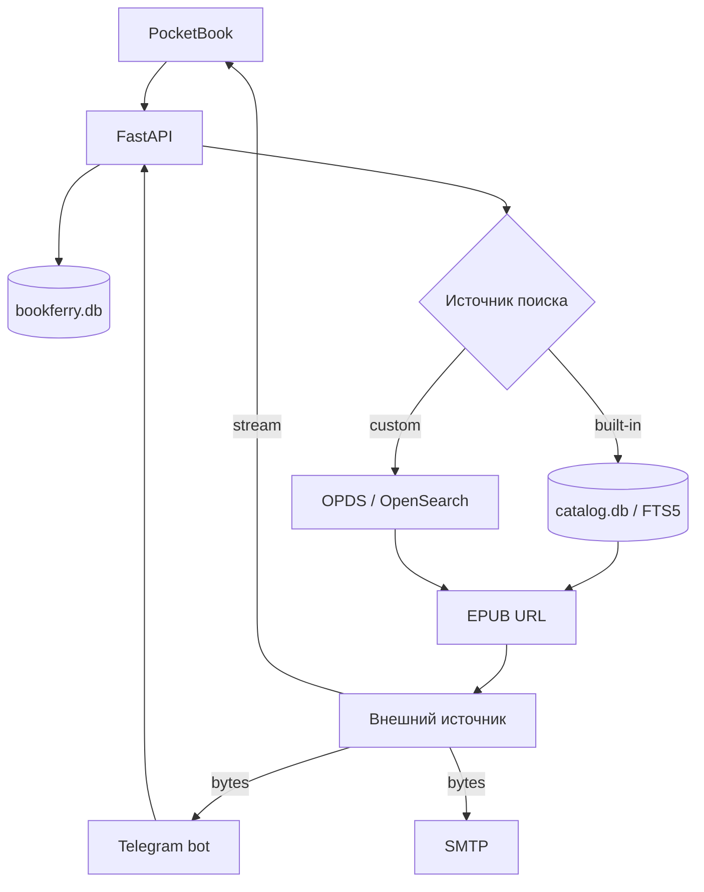

# BookFerry

**Русский** | [English](README_EN.md)

[](https://github.com/TerentievKirill/BookFerry/actions/workflows/tests.yml)

BookFerry — сервис поиска и доставки EPUB-книг для PocketBook и Telegram.

Проект состоит из FastAPI backend, локального полнотекстового индекса книжных каталогов и нативного клиента для PocketBook. Telegram-бот находится в отдельном репозитории: [BookFerryBot](https://github.com/TerentievKirill/BookFerryBot).

BookFerry уже работает как живой сервис. Главная архитектурная идея проекта: **метаданные книг ищутся локально, а сам EPUB загружается у внешнего источника только после выбора пользователем**. Сервер не хранит постоянную коллекцию книг.

> Текущий контракт проекта: EPUB only.

**Полезные ссылки:** [Swagger API](https://api.heartlab.app/docs) · [Allure report](https://allure.heartlab.app/) · [архитектура](ARCHITECTURE.md) · [тесты](tests/README_tests.md)

## Возможности

- локальный поиск по названию и автору через SQLite FTS5;
- четыре встроенных каталога;
- персональный OPDS 1.x / Atom / OpenSearch;
- единая модель пользователей для разных клиентов;
- нативный PocketBook-клиент на C / InkView;
- Telegram-клиент с отправкой книги в чат и на один или несколько e-mail;
- потоковая передача EPUB в PocketBook без предварительной полной загрузки на сервер;
- SSRF-защита для пользовательских OPDS и URL скачивания;
- атомарная пересборка большого книжного индекса;
- ежедневное production-обновление каталогов через systemd timer;
- request ID и структурированные серверные логи;
- Docker / Docker Compose;
- pytest smoke + external E2E + Allure.

## Как это устроено



Данные намеренно разделены:

- `bookferry.db` — пользователи, настройки и конфигурация каталогов;
- `catalog.db` — перестраиваемый индекс метаданных и FTS5.

Подробности и основные потоки данных описаны в [ARCHITECTURE.md](ARCHITECTURE.md).

## Встроенные каталоги

| Код | Каталог | Источник метаданных |
|---|---|---|
| `gutenberg` | Project Gutenberg | официальный CSV catalog |
| `anarchist` | The Anarchist Library | OPDS / AmuseWiki |
| `flibusta` | Flibusta | SQL dumps |
| `anarchist_ru` | Библиотека Анархизма | OPDS / AmuseWiki |

Для встроенных каталогов пользовательский поиск не обращается к внешнему сайту: он выполняется по локальному `catalog.db`. Сеть нужна только для обновления метаданных и скачивания выбранного EPUB.

## Клиенты

### PocketBook

Клиент находится в `pocketbook/main.c`, готовый бинарник — `pocketbook/BookFerry.app`.

При первом запуске приложение регистрируется на backend, получает UUID `uid` и сохраняет его в конфигурации устройства.

PocketBook умеет:

- выбирать встроенный каталог;
- подключать собственный OPDS;
- искать по названию или автору;
- перелистывать результаты;
- скачивать EPUB в `/mnt/ext1/Books`;
- вручную запускать обновление библиотеки ридера.

Для простого C-клиента часть GET endpoint'ов поддерживает `plain=1`. Это альтернативное текстовое представление тех же ресурсов, а не отдельный backend.

Скачивание идёт потоково: BookFerry начинает передавать EPUB клиенту сразу после получения upstream response. После завершения PocketBook отдельно сообщает backend результат через `/download/client-result`, поэтому серверные логи различают успешный HTTP stream и реально полученный устройством файл.

Инструкция по клиенту: [pocketbook/README_RU.md](pocketbook/README_RU.md).

### Telegram

Telegram-бот находится в [BookFerryBot](https://github.com/TerentievKirill/BookFerryBot) и использует тот же backend.

Для Telegram книга один раз загружается в память backend. Те же bytes используются для e-mail вложений и HTTP-ответа боту, после чего бот отправляет EPUB пользователю. Общие временные EPUB-файлы не используются.

## Поиск

### Встроенный каталог

```text
запрос пользователя
      ↓
SQLite FTS5 по title + author
      ↓
external_id книги
      ↓
построение URL конкретного источника
      ↓
результат клиенту
```

Размер страницы локального поиска — 20 записей. Пагинация использует непрозрачный для клиента token вида:

```text
local:20
local:40
local:60
```

URL скачивания не хранится в `catalog.db`: он строится из `catalog_code`, `base_url` и `external_id`.

### Пользовательский OPDS

Custom OPDS остаётся персональным сетевым источником пользователя и не импортируется в общий индекс.

При подключении backend:

1. проверяет внешний URL;
2. загружает Atom/OPDS feed;
3. ищет `rel="search"`;
4. при необходимости читает OpenSearch Description;
5. сохраняет поисковый шаблон;
6. использует его только для этого пользователя.

Поддерживаются OPDS 1.x / Atom / OpenSearch и EPUB acquisition links.

## Безопасность внешних URL

Пользовательские URL проходят через `app/services/safe_http.py`.

Проверяется:

- только `http://` и `https://`;
- отсутствие credentials в URL;
- DNS resolution до запроса;
- запрет loopback, private, link-local и других non-global IP;
- повторная проверка каждого redirect;
- повторная валидация URL перед фактическим скачиванием EPUB.

Это не позволяет использовать BookFerry как SSRF-прокси к внутренней сети сервера.

## Обновление книжного индекса

Весь production import находится в одном файле:

```text
scripts/update_all_catalogs.py
```

Updater:

1. скачивает исходные метаданные;
2. создаёт новый `catalog.db.update` отдельно от рабочей базы;
3. импортирует все четыре каталога;
4. проверяет минимальное число записей каждого источника;
5. выполняет `PRAGMA integrity_check`;
6. перестраивает FTS5 и запускает `ANALYZE`;
7. атомарно заменяет рабочий `catalog.db` через `os.replace()`.

Если любой этап завершается ошибкой, production-база остаётся прежней.

Минимальные защитные значения:

```text
Flibusta             >= 500 000
Project Gutenberg     >= 50 000
The Anarchist Library >= 10 000
Библиотека Анархизма  >= 500
```

Параллельные full update блокируются через `fcntl.flock()`. В `deploy/` лежат systemd service и timer для ежедневного запуска в `03:00 Asia/Almaty`.

## API

FastAPI публикует Swagger UI в `/docs`.

Основной API:

| Метод | Endpoint | Назначение |
|---|---|---|
| `GET` | `/health` | health check |
| `GET` | `/catalogs` | список доступных каталогов |
| `GET` | `/users/register` | регистрация клиента и получение `uid` |
| `GET` | `/users/{uid}` | профиль пользователя |
| `GET` | `/users/{uid}/catalog` | выбор встроенного каталога |
| `GET` | `/users/{uid}/opds` | выбор custom OPDS |
| `GET` | `/search` | поиск по `uid` или `telegram_id` |
| `GET` | `/download` | скачивание EPUB |
| `GET` | `/download/client-result` | итог загрузки со стороны PocketBook |

Для существующего Telegram-бота сохранен compatibility layer:

```text
POST  /search
POST  /send-book
GET   /users/telegram/{telegram_id}
PATCH /users/telegram/{telegram_id}/catalog
PATCH /users/telegram/{telegram_id}/opds
PATCH /users/telegram/{telegram_id}/emails
PATCH /users/telegram/{telegram_id}/subject
```

Core search/download logic при этом общая; compatibility endpoints адаптируют только контракт старого клиента.

## Логирование

Каждый HTTP-запрос получает `request_id`. Валидный `X-Request-ID` клиента сохраняется, иначе backend создаёт новый ID.

Основные события:

```text
SEARCH
SEARCH_RESULT
SEARCH_ERROR
DOWNLOAD
DOWNLOAD_STREAM_READY
DOWNLOAD_RESULT
DOWNLOAD_ERROR
DOWNLOAD_CLIENT_RESULT
USER_REGISTERED
PROFILE_READ
CATALOG_CHANGED
CUSTOM_OPDS_CHANGED
EMAILS_CHANGED
SUBJECT_CHANGED
```

Логгеры `bookferry.access` и `bookferry.api` можно связать по `request_id`.

## Стек

- Python 3.12
- FastAPI / Pydantic
- SQLite / FTS5
- Requests / lxml
- SMTP
- pytest / Allure
- Docker / Docker Compose
- systemd
- C / PocketBook InkView SDK

## Структура репозитория

```text
BookFerry/
├── app/
│   ├── api.py
│   ├── config.py
│   ├── logging_config.py
│   ├── models.py
│   ├── db/
│   │   ├── database.py
│   │   ├── users.py
│   │   ├── catalogs.py
│   │   └── catalog_database.py
│   └── services/
│       ├── local_search.py
│       ├── opds.py
│       ├── safe_http.py
│       ├── download.py
│       └── mail.py
├── pocketbook/
│   ├── BookFerry.app
│   ├── main.c
│   └── README_RU.md
├── scripts/
│   └── update_all_catalogs.py
├── tests/
│   ├── data/
│   ├── fixtures/
│   ├── framework/
│   ├── smoke/
│   ├── e2e/
│   └── README_tests.md
├── deploy/
│   ├── bookferry-catalog-update.service
│   └── bookferry-catalog-update.timer
├── .github/workflows/
│   ├── tests.yml
│   ├── external-e2e.yml
│   └── allure-report.yml
├── ARCHITECTURE.md
├── README_EN.md
├── LICENSE
├── main.py
├── Dockerfile
├── docker-compose.yml
└── requirements.txt
```

## Запуск

Создайте `.env`:

```env
SMTP_HOST=mail.example.com
SMTP_PORT=587
SMTP_LOGIN=books@example.com
SMTP_PASSWORD=secret
DEFAULT_SUBJECT=BookFerry

DB_NAME=/app/data/bookferry.db
CATALOG_DB_NAME=/app/data/catalog.db
DEFAULT_OPDS_URL=https://flibusta.is/opds/
```

`CATALOG_DB_NAME` можно не задавать: по умолчанию `catalog.db` создаётся рядом с `DB_NAME`.

Сборка и запуск:

```bash
docker compose up -d --build
```

Проверка:

```bash
curl http://127.0.0.1:8000/health
```

Логи:

```bash
docker compose logs -f bookferry
```

Новая `catalog.db` создаётся пустой. Для production-наполнения используется `scripts/update_all_catalogs.py`.

## Тестирование

Deterministic smoke suite:

```bash
pytest tests/smoke -v -s -m "not e2e"
```

External E2E с реальными книжными источниками:

```bash
pytest tests/e2e/test_external_e2e.py -v -s -m e2e
```

Все тесты:

```bash
pytest tests -v
```

Smoke CI запускается на push в `main`/`testing` и pull request в `main`. External E2E вынесен в отдельный manual workflow. Ежедневный Allure workflow объединяет результаты backend smoke, backend external E2E и E2E Telegram-бота в один отчёт.

Подробнее: [tests/README_tests.md](tests/README_tests.md).

## Архитектурные инварианты

- сервер хранит метаданные, а не постоянную коллекцию EPUB;
- встроенный поиск остаётся локальным;
- пользовательские данные отделены от перестраиваемого книжного индекса;
- custom OPDS и внешние book URL считаются недоверенным вводом;
- большой импорт никогда не пишет напрямую в рабочий `catalog.db`;
- client-specific API остаётся тонким адаптером над общей backend-логикой;
- общие временные EPUB-файлы не используются.

## Лицензия

Исходный код доступен по [BookFerry Non-Commercial License](LICENSE): его можно использовать, копировать, изменять, публиковать и распространять для некоммерческих целей. Коммерческое использование требует отдельного письменного разрешения автора.

Это **source-available**, а не OSI-approved open-source лицензия.