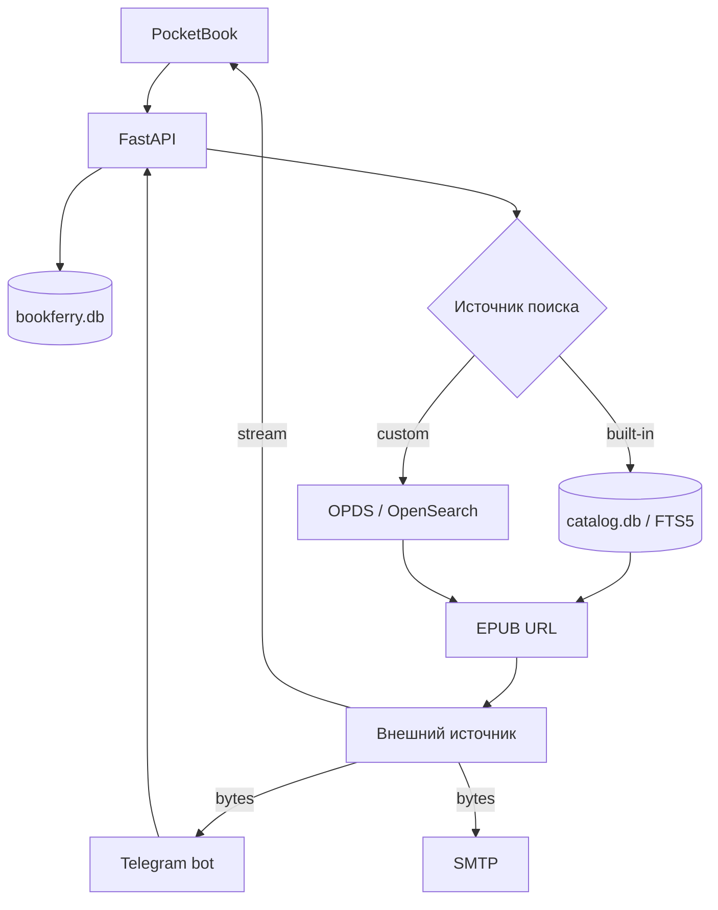

# BookFerry

BookFerry — сервис поиска и доставки EPUB-книг для PocketBook и Telegram.

Проект состоит из FastAPI backend, локального полнотекстового каталога книг и нативного клиента для PocketBook. Telegram-бот находится в отдельном репозитории: [BookFerryBot](https://github.com/TerentievKirill/BookFerryBot).

Главная идея: **метаданные ищутся локально, а файл книги загружается у источника только после выбора пользователем**. BookFerry не хранит постоянную коллекцию EPUB на сервере.

> Текущий контракт проекта — EPUB only.

## Возможности

- локальный поиск по названию и автору через SQLite FTS5;
- четыре встроенных книжных каталога;
- пользовательский OPDS 1.x / Atom / OpenSearch;
- единая модель пользователей для разных клиентов;
- нативный клиент PocketBook на C / InkView;
- Telegram-клиент с отправкой книги в чат и на один или несколько e-mail;
- пользовательская тема e-mail;
- потоковая передача EPUB для PocketBook;
- SSRF-защита для пользовательских OPDS и URL скачивания;
- безопасная атомарная пересборка большого книжного индекса;
- автоматическое ежедневное обновление каталогов;
- request ID и структурированные серверные логи;
- Docker / Docker Compose.

Подробное устройство проекта описано в [ARCHITECTURE.md](ARCHITECTURE.md).

## Архитектура в двух словах



Пользовательские данные и книжный индекс намеренно разделены:

- `bookferry.db` — пользователи, настройки и список каталогов;
- `catalog.db` — перестраиваемый индекс метаданных книг и FTS5.

## Встроенные каталоги

| Код | Каталог | Источник метаданных |
|---|---|---|
| `flibusta` | Flibusta | SQL dumps |
| `gutenberg` | Project Gutenberg | официальный CSV catalog |
| `anarchist` | The Anarchist Library | OPDS / AmuseWiki |
| `anarchist_ru` | Библиотека Анархизма | OPDS / AmuseWiki |

Для встроенных каталогов пользовательский поиск не обращается к внешнему сайту. Поиск идёт по локальному `catalog.db`, а сеть используется только для обновления метаданных и скачивания выбранного EPUB.

## Клиенты

### PocketBook

Исходник клиента находится в `pocketbook/main.c`.

При первом запуске приложение регистрируется на backend и получает UUID `uid`, который сохраняется в:

```text
/mnt/ext1/system/config/BookFerry/config.cfg
```

PocketBook умеет:

- выбирать встроенный каталог;
- подключать собственный OPDS;
- искать по названию или автору;
- перелистывать результаты;
- скачивать EPUB в `/mnt/ext1/Books`;
- вручную запускать обновление библиотеки ридера.

Для простого C-клиента API может отдавать компактный текстовый формат через `plain=1`.

Скачивание для PocketBook работает потоково: backend начинает передавать EPUB клиенту сразу после получения ответа от источника, не дожидаясь полной загрузки файла на сервер.

После завершения загрузки PocketBook отдельно сообщает backend итог операции через `/download/client-result`. Это позволяет отличить успешную отдачу `StreamingResponse` на сервере от реально полученного клиентом файла.

Дополнительные детали — в [pocketbook/README.md](pocketbook/README.md).

### Telegram

Telegram-бот находится в отдельном репозитории [BookFerryBot](https://github.com/TerentievKirill/BookFerryBot) и использует тот же backend.

После выбора книги backend:

1. загружает EPUB в память;
2. отправляет те же байты на настроенные e-mail;
3. возвращает EPUB боту;
4. бот отправляет файл пользователю в Telegram.

Временные файлы для этой цепочки не используются, поэтому параллельные запросы одной книги не конфликтуют между собой.

## Поиск

### Встроенный каталог

```text
запрос пользователя
      ↓
SQLite FTS5 по title + author
      ↓
external_id книги
      ↓
построение URL конкретного источника
      ↓
результат клиенту
```

Размер страницы локального поиска — 20 записей. Пагинация использует внутренние токены:

```text
local:20
local:40
local:60
```

URL скачивания не хранится в `catalog.db`. Он строится из `catalog_code`, `base_url` и `external_id`.

### Пользовательский OPDS

Custom OPDS остаётся персональным сетевым источником пользователя и не импортируется в общий индекс.

При подключении backend:

1. проверяет URL;
2. загружает Atom/OPDS feed;
3. ищет `rel="search"`;
4. при необходимости читает OpenSearch Description;
5. сохраняет поисковый шаблон;
6. использует его только для этого пользователя.

Сейчас поддерживаются OPDS 1.x / Atom / OpenSearch и EPUB acquisition links.

## Безопасность внешних URL

Пользовательские URL обрабатываются через `app/services/safe_http.py`.

Проверки включают:

- только `http://` и `https://`;
- запрет URL с логином или паролем;
- запрет loopback, private, link-local и других non-global IP;
- повторную проверку каждого redirect;
- ту же проверку перед фактическим скачиванием EPUB.

Это не позволяет использовать BookFerry как SSRF-прокси к внутренней сети сервера.

## Обновление книжного индекса

Основной production updater:

```text
scripts/update_all_catalogs.py
```

Он строит новый snapshot всех встроенных каталогов отдельно от рабочей базы, проверяет минимальное количество записей и `PRAGMA integrity_check`, после чего атомарно заменяет `catalog.db`.

Если импорт или проверка завершаются ошибкой, рабочий индекс остаётся прежним.

Минимальные защитные значения:

```text
Flibusta             >= 500 000
Project Gutenberg     >= 50 000
The Anarchist Library >= 10 000
Библиотека Анархизма  >= 500
```

От одновременного запуска двух обновлений защищает lock-файл.

В `deploy/` находятся systemd unit и timer для ежедневного запуска в `03:00 Asia/Almaty`.

## API

FastAPI автоматически публикует Swagger UI в `/docs`.

Основные ручки текущего PocketBook API:

| Метод | Endpoint | Назначение |
|---|---|---|
| `GET` | `/health` | health check |
| `GET` | `/catalogs` | список каталогов |
| `GET` | `/users/register` | регистрация устройства и получение `uid` |
| `GET` | `/users/{uid}` | профиль |
| `GET` | `/users/{uid}/catalog` | выбор встроенного каталога |
| `GET` | `/users/{uid}/opds` | выбор custom OPDS |
| `GET` | `/search` | поиск книг по `uid` |
| `GET` | `/download` | потоковая загрузка EPUB по `uid` |
| `GET` | `/download/client-result` | итог загрузки со стороны PocketBook |

Для PocketBook часть этих endpoint'ов поддерживает `plain=1`, чтобы клиенту на C не приходилось разбирать JSON.

Для совместимости с текущим Telegram-ботом отдельно сохранены:

```text
POST /search
POST /send-book
GET   /users/telegram/{telegram_id}
PATCH /users/telegram/{telegram_id}/catalog
PATCH /users/telegram/{telegram_id}/opds
PATCH /users/telegram/{telegram_id}/emails
PATCH /users/telegram/{telegram_id}/subject
```

Telegram compatibility layer использует ту же backend-логику поиска и скачивания, но сохраняет старый контракт уже работающего бота.

## Логирование

Каждый HTTP-запрос получает `request_id`. Если клиент передаёт корректный `X-Request-ID`, backend сохраняет его; иначе создаёт новый.

Пример:

```text
2026-08-10 13:05:47+0500 | INFO | bookferry.api | request_id=... DOWNLOAD ...
2026-08-10 13:05:47+0500 | INFO | bookferry.api | request_id=... DOWNLOAD_RESULT ...
2026-08-10 13:05:47+0500 | INFO | bookferry.access | request_id=... HTTP method=GET path=/download status=200 ...
```

PocketBook streaming дополнительно логирует время получения upstream response и полный объём переданных данных.

## Стек

- Python 3.12
- FastAPI
- Pydantic
- SQLite / FTS5
- Requests
- lxml
- SMTP
- Docker / Docker Compose
- systemd
- C / PocketBook InkView SDK

## Структура репозитория

```text
BookFerry/
├── app/
│   ├── api.py
│   ├── config.py
│   ├── logging_config.py
│   ├── models.py
│   ├── db/
│   │   ├── database.py
│   │   ├── users.py
│   │   ├── catalogs.py
│   │   └── catalog_database.py
│   └── services/
│       ├── local_search.py
│       ├── opds.py
│       ├── safe_http.py
│       ├── download.py
│       └── mail.py
├── pocketbook/
│   ├── main.c
│   └── README.md
├── scripts/
│   ├── catalog_utils.py
│   ├── import_flibusta.py
│   ├── import_gutenberg.py
│   ├── import_anarchist.py
│   ├── import_anarchist_ru.py
│   ├── update_all_catalogs.py
│   └── smoke_pocketbook.py
├── tests/
│   ├── fixtures/
│   ├── framework/
│   ├── smoke/
│   └── e2e/
├── deploy/
│   ├── bookferry-catalog-update.service
│   └── bookferry-catalog-update.timer
├── ARCHITECTURE.md
├── main.py
├── Dockerfile
├── docker-compose.yml
└── requirements.txt
```

## Запуск

Создайте `.env`:

```env
SMTP_HOST=mail.example.com
SMTP_PORT=587
SMTP_LOGIN=books@example.com
SMTP_PASSWORD=secret
DEFAULT_SUBJECT=BookFerry

DB_NAME=/app/data/bookferry.db
CATALOG_DB_NAME=/app/data/catalog.db
DEFAULT_OPDS_URL=https://flibusta.is/opds/
```

Сборка и запуск:

```bash
docker compose up -d --build
```

Проверка:

```bash
curl http://127.0.0.1:8000/health
```

Логи:

```bash
docker compose logs -f bookferry
```

Новая `catalog.db` создаётся пустой. Для наполнения встроенных каталогов используется `scripts/update_all_catalogs.py` или отдельные импортёры из `scripts/`.

Полный импорт Flibusta и других источников предназначен для production и может занимать значительное время.

## PocketBook smoke test

После запуска backend можно проверить основной PocketBook flow:

```bash
python scripts/smoke_pocketbook.py \
  --base-url http://127.0.0.1:8000 \
  --query "лабиринт отражений"
```

Сценарий проверяет регистрацию, получение каталогов, выбор каталога, поиск и загрузку EPUB.

## Тестирование

В репозитории есть небольшой pytest API framework, deterministic smoke suite и отдельные external E2E tests.

Smoke запускается на каждый push / pull request:

```bash
pytest tests -v -m "not e2e"
```

External E2E проверяет реальные источники книг и может запускаться отдельно:

```bash
pytest tests/e2e -v -s -m e2e
```

Все тесты:

```bash
pytest tests -v
```

Подробная структура и принципы тестового фреймворка описаны в [tests/README_tests.md](tests/README_tests.md).

## Основные архитектурные принципы

- сервер хранит метаданные, а не постоянную коллекцию EPUB;
- встроенный поиск должен оставаться локальным;
- пользовательские данные отделены от перестраиваемого книжного индекса;
- custom OPDS является недоверенным внешним вводом;
- большой импорт никогда не пишет непосредственно в рабочий `catalog.db`;
- клиентские особенности не должны дублировать backend API без необходимости;
- compatibility endpoints сохраняются только там, где они нужны существующему клиенту.
