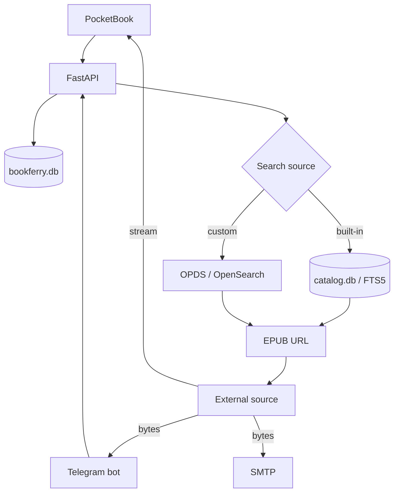

# BookFerry

[Русский](README.md) | **English**

[](https://github.com/TerentievKirill/BookFerry/actions/workflows/tests.yml)

BookFerry is an EPUB search and delivery service for PocketBook and Telegram.

The project consists of a FastAPI backend, a local full-text book catalog index, and a native PocketBook client. The Telegram bot lives in a separate repository: [BookFerryBot](https://github.com/TerentievKirill/BookFerryBot).

BookFerry is already running as a live service. Its main architectural idea is simple: **book metadata is searched locally, while the EPUB itself is downloaded from the external source only after the user selects a book**. The server does not keep a permanent collection of book files.

> Current project contract: EPUB only.

**Useful links:** [Swagger API](https://api.heartlab.app/docs) · [Allure report](https://allure.heartlab.app/) · [architecture](ARCHITECTURE.md) · [test documentation](tests/README_tests_EN.md)

## Features

- local title/author search using SQLite FTS5;
- four built-in book catalogs;
- personal OPDS 1.x / Atom / OpenSearch sources;
- one user model for multiple clients;
- native PocketBook client written in C / InkView;
- Telegram client with delivery to chat and one or more e-mail addresses;
- streamed EPUB delivery to PocketBook without buffering the whole file first;
- SSRF protection for custom OPDS and download URLs;
- safe atomic rebuild of the large local catalog index;
- daily production catalog refresh through systemd;
- request IDs and structured server logging;
- Docker / Docker Compose;
- pytest smoke tests, external E2E tests and Allure reporting.

## Architecture at a glance



The data stores are deliberately separated:

- `bookferry.db` — users, settings and catalog configuration;
- `catalog.db` — rebuildable book metadata index and FTS5 data.

The rationale and full data flows are documented in [ARCHITECTURE.md](ARCHITECTURE.md).

## Built-in catalogs

| Code | Catalog | Metadata source |
|---|---|---|
| `gutenberg` | Project Gutenberg | official CSV catalog |
| `anarchist` | The Anarchist Library | OPDS / AmuseWiki |
| `flibusta` | Flibusta | SQL dumps |
| `anarchist_ru` | Библиотека Анархизма | OPDS / AmuseWiki |

Searches in built-in catalogs do not call those sites. They run against the local `catalog.db`; the network is used only for metadata refresh and for downloading the EPUB selected by the user.

## Clients

### PocketBook

The client source is `pocketbook/main.c`; the ready-to-install binary is `pocketbook/BookFerry.app`.

On first launch the app registers with the backend, receives a UUID `uid` and stores it in the device configuration.

The PocketBook client can:

- choose a built-in catalog;
- connect a custom OPDS source;
- search by title or author;
- page through results;
- download EPUB files to `/mnt/ext1/Books`;
- manually trigger a PocketBook library refresh.

Some GET endpoints support `plain=1` because a compact text protocol is easier to parse from the simple C client. This is an alternative representation of the same resources, not a separate backend.

Downloads are streamed. BookFerry starts forwarding EPUB data as soon as the upstream response is ready. After the transfer the PocketBook client reports its final result through `/download/client-result`, allowing server logs to distinguish a successful HTTP stream from a file actually received by the device.

PocketBook documentation: [pocketbook/README_RU.md](pocketbook/README_RU.md).

### Telegram

The Telegram bot is maintained in [BookFerryBot](https://github.com/TerentievKirill/BookFerryBot) and uses the same backend.

For Telegram delivery, the backend downloads the EPUB once into memory. The same bytes are used for configured e-mail attachments and for the HTTP response returned to the bot, which then sends the file to the user. Shared temporary EPUB files are not used.

## Search

### Built-in catalogs

```text
user query
    ↓
SQLite FTS5 over title + author
    ↓
book external_id
    ↓
build source-specific EPUB URL
    ↓
return result to the client
```

Local search uses pages of 20 results. Pagination is represented by an opaque token such as:

```text
local:20
local:40
local:60
```

Download URLs are not stored in `catalog.db`; they are constructed from `catalog_code`, `base_url` and `external_id`.

### Custom OPDS

A custom OPDS source remains a personal network source and is not imported into the global index.

When a custom source is configured, the backend:

1. validates the external URL;
2. loads the Atom/OPDS feed;
3. discovers `rel="search"`;
4. reads an OpenSearch Description when required;
5. stores the resulting search template;
6. uses that template only for the current user.

Current protocol support covers OPDS 1.x / Atom / OpenSearch and EPUB acquisition links.

## External URL security

User-controlled URLs are handled through `app/services/safe_http.py`.

The checks include:

- only `http://` and `https://` schemes;
- no credentials embedded in URLs;
- DNS resolution before a request;
- rejection of loopback, private, link-local and other non-global IP addresses;
- validation of every redirect target;
- the same validation before the actual EPUB download.

This prevents BookFerry from becoming an SSRF proxy into the server's private network.

## Catalog refresh

All production import logic is intentionally kept in one script:

```text
scripts/update_all_catalogs.py
```

The updater:

1. downloads source metadata;
2. creates a new `catalog.db.update` next to the production database;
3. imports all four built-in catalogs;
4. validates a minimum record count for every source;
5. runs `PRAGMA integrity_check`;
6. rebuilds FTS5 and runs `ANALYZE`;
7. atomically replaces the production `catalog.db` using `os.replace()`.

If any step fails, the current production index remains untouched.

Minimum safety thresholds:

```text
Flibusta             >= 500,000
Project Gutenberg     >= 50,000
The Anarchist Library >= 10,000
Библиотека Анархизма  >= 500
```

Concurrent full updates are prevented by `fcntl.flock()`. The `deploy/` directory contains a systemd service and timer that run the updater daily at `03:00 Asia/Almaty`.

## API

FastAPI exposes Swagger UI at `/docs`.

Main API:

| Method | Endpoint | Purpose |
|---|---|---|
| `GET` | `/health` | health check |
| `GET` | `/catalogs` | list available catalogs |
| `GET` | `/users/register` | register a client and receive `uid` |
| `GET` | `/users/{uid}` | read user profile |
| `GET` | `/users/{uid}/catalog` | select a built-in catalog |
| `GET` | `/users/{uid}/opds` | select a custom OPDS source |
| `GET` | `/search` | search by `uid` or `telegram_id` |
| `GET` | `/download` | download an EPUB |
| `GET` | `/download/client-result` | receive the final PocketBook download result |

A compatibility layer is kept for the existing Telegram bot:

```text
POST  /search
POST  /send-book
GET   /users/telegram/{telegram_id}
PATCH /users/telegram/{telegram_id}/catalog
PATCH /users/telegram/{telegram_id}/opds
PATCH /users/telegram/{telegram_id}/emails
PATCH /users/telegram/{telegram_id}/subject
```

The core search and download code remains shared; these endpoints only adapt the legacy Telegram contract.

## Logging

Every HTTP request gets a `request_id`. A valid client-provided `X-Request-ID` is preserved; otherwise the backend creates one.

Main business events include:

```text
SEARCH
SEARCH_RESULT
SEARCH_ERROR
DOWNLOAD
DOWNLOAD_STREAM_READY
DOWNLOAD_RESULT
DOWNLOAD_ERROR
DOWNLOAD_CLIENT_RESULT
USER_REGISTERED
PROFILE_READ
CATALOG_CHANGED
CUSTOM_OPDS_CHANGED
EMAILS_CHANGED
SUBJECT_CHANGED
```

`bookferry.access` and `bookferry.api` logs can be correlated through the request ID.

## Stack

- Python 3.12
- FastAPI / Pydantic
- SQLite / FTS5
- Requests / lxml
- SMTP
- pytest / Allure
- Docker / Docker Compose
- systemd
- C / PocketBook InkView SDK

## Repository structure

```text
BookFerry/
├── app/
│   ├── api.py
│   ├── config.py
│   ├── logging_config.py
│   ├── models.py
│   ├── db/
│   │   ├── database.py
│   │   ├── users.py
│   │   ├── catalogs.py
│   │   └── catalog_database.py
│   └── services/
│       ├── local_search.py
│       ├── opds.py
│       ├── safe_http.py
│       ├── download.py
│       └── mail.py
├── pocketbook/
│   ├── BookFerry.app
│   ├── main.c
│   └── README_RU.md
├── scripts/
│   └── update_all_catalogs.py
├── tests/
│   ├── data/
│   ├── fixtures/
│   ├── framework/
│   ├── smoke/
│   ├── e2e/
│   ├── README_tests_EN.md
│   └── README_tests_RU.md
├── deploy/
│   ├── bookferry-catalog-update.service
│   └── bookferry-catalog-update.timer
├── .github/workflows/
│   ├── tests.yml
│   ├── external-e2e.yml
│   └── allure-report.yml
├── ARCHITECTURE.md
├── README.md
├── LICENSE
├── main.py
├── Dockerfile
├── docker-compose.yml
└── requirements.txt
```

## Running locally

Create `.env`:

```env
SMTP_HOST=mail.example.com
SMTP_PORT=587
SMTP_LOGIN=books@example.com
SMTP_PASSWORD=secret
DEFAULT_SUBJECT=BookFerry

DB_NAME=/app/data/bookferry.db
CATALOG_DB_NAME=/app/data/catalog.db
DEFAULT_OPDS_URL=https://flibusta.is/opds/
```

`CATALOG_DB_NAME` is optional. By default `catalog.db` is created next to `DB_NAME`.

Build and start:

```bash
docker compose up -d --build
```

Health check:

```bash
curl http://127.0.0.1:8000/health
```

Logs:

```bash
docker compose logs -f bookferry
```

A fresh `catalog.db` starts empty. Production data is populated by `scripts/update_all_catalogs.py`.

## Testing

Deterministic smoke suite:

```bash
pytest tests/smoke -v -s -m "not e2e"
```

External E2E against real book sources:

```bash
pytest tests/e2e/test_external_e2e.py -v -s -m e2e
```

All tests:

```bash
pytest tests -v
```

Smoke CI runs on pushes to `main`/`testing` and pull requests targeting `main`. External E2E has its own manually triggered workflow. A daily Allure workflow combines backend smoke, backend external E2E and Telegram bot E2E results into one report.

More details: [tests/README_tests_EN.md](tests/README_tests_EN.md).

## Architectural invariants

- the server stores metadata, not a permanent EPUB collection;
- built-in search stays local;
- user data stays separate from the rebuildable book index;
- custom OPDS and external book URLs are untrusted input;
- large imports never write directly into the active `catalog.db`;
- client-specific API remains a thin adapter over shared backend logic;
- shared temporary EPUB paths are not used.

## License

The source code is available under the [BookFerry Non-Commercial License](LICENSE). You may use, copy, modify, publish, distribute and create derivative works for non-commercial purposes. Commercial use requires separate written permission from the author.

This is a **source-available** license, not an OSI-approved open-source license.