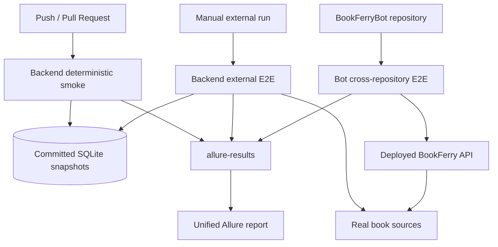

# BookFerry Test Engineering

BookFerry is a small production project, so there is little value in building hundreds of tests just to increase the test count.

Instead, I built the test infrastructure using the same principles I would use for a much larger production system, while keeping the actual suite proportional to the size of the project.

The repository is intended to demonstrate **test engineering decisions rather than test volume**. A test for something like `GET /health -> 200 OK` would be trivial to add, but would not demonstrate anything particularly interesting.

At the same time, these tests are not portfolio-only examples: they solve practical regression and integration problems for the live BookFerry service.

With the current parametrization the project has **22 test cases** across three deliberately different layers:

| Layer | Cases | Main purpose |
|---|---:|---|
| Deterministic backend smoke | 10 | Detect basic BookFerry regressions quickly |
| Backend external E2E | 8 | Check catalog flows and the real EPUB download boundary |
| BookFerryBot cross-repository E2E | 4 | Verify the real client/server integration against the deployed API |

**Live Allure report:** https://allure.heartlab.app/

## Testing strategy

The suites are separated by what a failure means, not just by directory structure.

### 1. Deterministic smoke — did I break BookFerry?

The smoke suite checks the basic application behavior and current client contracts.

It runs against committed SQLite test snapshots and does not require external book providers to be available. That makes it useful as fast CI feedback: a smoke failure normally points to the application or its API contract rather than to a temporary Internet dependency.

The suite runs automatically on pull requests targeting `main` and on pushes to `main` / `testing`.

Typical coverage includes:

- PocketBook registration;
- Telegram lazy user creation through the real settings flow;
- invalid client type validation;
- profile reads and unknown-user behavior;
- catalog switching for both real client paths;
- deterministic local search;
- the business flow `register/create -> select catalog -> search`.

The practical question is intentionally simple:

> Did this change break the basic application used by current clients?

### 2. Backend external E2E — does BookFerry still work with the outside world?

BookFerry depends on external book sources. Those dependencies should be tested, but they should not make every normal pull request flaky.

The external backend suite is therefore kept separate from deterministic smoke.

It is parametrized across all four built-in catalogs:

- Project Gutenberg;
- The Anarchist Library;
- Flibusta;
- Библиотека Анархизма.

For every catalog the suite verifies that BookFerry can find a known title using its catalog metadata. The download scenarios then continue across the network boundary and retrieve a real EPUB from the external source.

The returned file is checked as an actual book payload, not just as a successful HTTP response:

```python
assert response.status_code == 200
assert response.headers["Content-Type"].startswith("application/epub")
assert len(response.content) > 1000
assert response.content.startswith(b"PK")
```

A failure here has a different diagnostic meaning from a smoke failure: BookFerry may have regressed, but an external provider may also be unavailable or may have changed its behavior.

That distinction is the reason this suite has its own workflow.

### 3. Cross-repository E2E — does the real client still work with the real server?

This is the most system-level scenario in the project.

The Telegram client is maintained in a separate repository: [BookFerryBot](https://github.com/TerentievKirill/BookFerryBot).

Its E2E test does **not** use a test-only HTTP wrapper. It imports the same production API client functions that the bot itself uses:

```python
from app.api_client import download_book, search_books, update_catalog
```

The parametrized scenario performs the real client operations:

```text
BookFerryBot production API client
              ↓
       deployed BookFerry API
              ↓
       select real catalog
              ↓
          search book
              ↓
       external EPUB source
              ↓
     download + validate EPUB
```

So a server-side contract change can be caught from the point of view of an independently deployed client rather than only from the backend test framework.

The bot E2E currently runs four catalog cases and validates the downloaded EPUB by filename, payload size and ZIP/EPUB signature.

This gives the project a useful cross-repository compatibility check without building a separate heavyweight end-to-end environment.

## Test architecture



The important part of this diagram is not the number of boxes. Each level answers a different question and has a different failure boundary.

## Representative test design

The individual tests stay deliberately small. Infrastructure details belong in reusable layers; scenario files should make the behavior obvious.

A typical smoke scenario reads almost like the product flow:

```python
user = flow.create_configured_pocketbook_user(
    catalog_id=3,
)

book = flow.find_first_book(
    uid=user.uid,
    query="Лабиринт отражений",
)

assert book.title
assert book.url
```

The test does not know how registration, catalog selection or search requests are serialized. Those details belong to the API and flow layers.

Another useful property is that the same business capability is exercised through both current client contracts. PocketBook uses the `uid`-based API, while Telegram still has compatibility endpoints. The tests can therefore detect client-specific regressions without duplicating the whole framework.

## Small framework, clear responsibilities

The local framework is intentionally simple:

```text
BookFerryApi
     ↓
fixtures + reusable flows
     ↓
test scenarios
```

### `framework/api.py` — HTTP only

`BookFerryApi` is a thin wrapper around the real HTTP API.

Each method performs one request and returns the original `requests.Response`.

Assertions do not belong here:

```python
response = api.register_user(client_type="pocketbook")
assert response.status_code == 200
```

This keeps protocol details reusable without hiding test expectations behind framework magic.

### `framework/flows.py` — reusable business behavior

Flows contain multi-step operations that appear in more than one scenario:

```text
register/create client
        ↓
select catalog
        ↓
read profile
        ↓
search books
```

Single HTTP calls stay in `BookFerryApi`. A flow is added only when it represents reusable behavior rather than as another abstraction layer for its own sake.

### `framework/models.py` — independent contract models

The test suite does not import application Pydantic response models from `app.models`.

Instead it validates HTTP responses with independent test-side models:

```python
user = User.model_validate(response.json())
```

That way model validation checks the external HTTP contract instead of validating an application response using the exact same model that generated it.

### Fixtures — state through public APIs

Fixtures prepare users and configuration through BookFerry HTTP endpoints.

Tests do not directly edit SQLite to create convenient states. The databases are controlled test data, but the scenarios still interact with the service the way a client does.

## Deterministic test data

Smoke uses two committed SQLite snapshots:

```text
bookferry_test.db  — users and catalog configuration
catalog_test.db    — small searchable metadata snapshot
```

The Docker test container receives their paths through environment variables:

```text
DB_NAME=/app/tests/data/bookferry_test.db
CATALOG_DB_NAME=/app/tests/data/catalog_test.db
```

Every CI runner starts from the repository copy, so state created by one run disappears with that runner.

This gives smoke predictable search data without mocking the BookFerry API itself.

## CI/CD and reporting

The automation around the tests is part of the test design, not an afterthought.

### Pull request feedback

[`tests.yml`](../.github/workflows/tests.yml) builds the application in Docker, starts it with deterministic test databases and runs the smoke suite.

```text
checkout
   ↓
install dependencies
   ↓
build BookFerry Docker image
   ↓
start isolated BookFerry
   ↓
run deterministic smoke
   ↓
upload allure-results
```

The goal is fast and interpretable feedback on ordinary changes.

### External backend checks

[`external-e2e.yml`](../.github/workflows/external-e2e.yml) is manually triggered and runs the backend external suite against real book sources.

Keeping it separate means a third-party outage does not automatically turn normal development CI red.

### Combined quality run

[`allure-report.yml`](../.github/workflows/allure-report.yml) is the larger scheduled/manual quality workflow.

It checks out **two repositories**:

```text
BookFerry
BookFerryBot
```

and combines three test groups in one run:

```text
BookFerry deterministic smoke
BookFerry backend external E2E
BookFerryBot cross-repository E2E
```

The backend suites run against the Dockerized test instance. The BookFerryBot scenario uses the bot's production API client and connects to the deployed BookFerry API.

All results are written into the same `allure-results` directory and published as one Allure 3 report.

**Published report:** https://allure.heartlab.app/

Allure metadata stays intentionally minimal:

```python
@allure.parent_suite("BookFerry")
@allure.suite("Smoke")
@allure.title("PocketBook user can be registered")
```

The report should make a failure easier to understand; reporting code should not become a second test framework.

## What does a failure tell us?

One reason for keeping the layers separate is diagnostic value.

| Failure | First area to investigate |
|---|---|
| Deterministic smoke | BookFerry regression or HTTP contract change |
| Backend external E2E | BookFerry integration or external source |
| BookFerryBot E2E | Bot/server compatibility, deployed backend, or external source |

This is more useful than one large suite where every red test means "something somewhere is broken".

## Deliberate trade-offs

A few choices are intentionally boring.

**Why not test every endpoint?**  
Because this is a small project and test count is not the goal. Straightforward low-value cases such as a dedicated `GET /health -> 200` test can be added at any time; they do not demonstrate a different testing technique or protect an important business flow today.

**Why not mock every external dependency?**  
Smoke is already deterministic. The external suite exists specifically to verify the real integration boundary that mocks cannot prove.

**Why keep external E2E out of normal PR CI?**  
A third-party outage should not look like a deterministic regression in every pull request.

**Why independent response models?**  
Reusing application models in tests would make part of the contract validation self-referential.

**Why use the bot's production API client in E2E?**  
Because the interesting question is whether the independently deployed client still works after backend changes, not whether a second test-only client can call the same URL.

**Why no direct DB helper, repository abstraction or generic HTTP hierarchy?**  
Because none is needed yet. The framework should become more complex only when the product and test suite create a real reason for that complexity.

## Repository structure

```text
tests/
├── data/
│   ├── bookferry_test.db
│   └── catalog_test.db
├── fixtures/
│   └── users.py
├── framework/
│   ├── api.py
│   ├── flows.py
│   └── models.py
├── smoke/
│   ├── test_book_flow.py
│   └── test_users.py
├── e2e/
│   └── test_external_e2e.py
├── conftest.py
└── README_tests.md
```

The cross-repository client scenario lives in:

```text
BookFerryBot/tests/test_external_e2e.py
```

## Running locally

BookFerry should be available at:

```text
http://127.0.0.1:8000
```

Run deterministic smoke:

```bash
pytest tests/smoke -v -s -m "not e2e"
```

Run backend external E2E:

```bash
pytest tests/e2e/test_external_e2e.py -v -s -m e2e
```

Run all backend tests:

```bash
pytest tests -v
```

Use another backend instance:

```bash
pytest tests -v --base-url=http://example:8000
```

The framework is deliberately small. The interesting part is not how many abstractions or tests can be added, but how little infrastructure is needed to get useful, diagnosable confidence from a real running system.