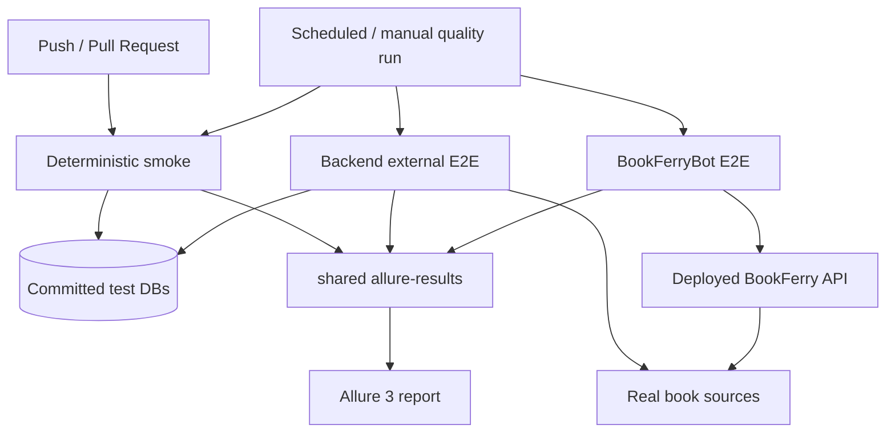

# BookFerry Test Engineering

BookFerry is a small production project, so there is little value in building hundreds of tests just to increase the test count.

Instead, I built the test infrastructure using the same principles I would use for a much larger production system, while keeping the suite proportional to the size of the project.

The repository is intended to demonstrate **test engineering decisions rather than test volume**. A dedicated `GET /health -> 200 OK` test would be trivial to add, but it would not demonstrate anything particularly interesting here.

At the same time, these are not portfolio-only examples: they protect a live service, check real external integrations and verify compatibility with a separately developed Telegram client.

With the current parametrization there are **22 test cases**:

| Layer | Cases | What it answers |
|---|---:|---|
| Backend smoke | 10 | Did this change break the basic application? |
| Backend external E2E | 8 | Does BookFerry still work with real book sources? |
| BookFerryBot E2E | 4 | Does the real client still work with the deployed server? |

**Live Allure:** https://allure.heartlab.app/

**Code:** [backend smoke](https://github.com/TerentievKirill/BookFerry/tree/readme/tests/smoke) · [backend E2E](https://github.com/TerentievKirill/BookFerry/blob/readme/tests/e2e/test_external_e2e.py) · [BookFerryBot](https://github.com/TerentievKirill/BookFerryBot) · [bot E2E](https://github.com/TerentievKirill/BookFerryBot/blob/main/tests/test_external_e2e.py) · [combined workflow](../.github/workflows/allure-report.yml)

## Testing strategy

The suites are separated by **what a failure means**, not just by directory structure.

### 1. Deterministic smoke

Smoke runs against committed SQLite test snapshots and does not depend on external book providers. It is used as fast feedback on pull requests targeting `main` and on pushes to `main` / `testing`.

It covers both current backend client contracts.

**PocketBook API**

- registration and UUID creation;
- profile read;
- catalog change;
- unknown user handling;
- local book search through the `uid` contract.

**Telegram compatibility API**

- lazy user creation through the real settings flow;
- profile read;
- catalog change;
- unknown Telegram user handling;
- local search through the Telegram contract.

The suite also checks unsupported client types, independent response-model validation and the basic business flow:

```text
register / create
      ↓
select catalog
      ↓
search
```

The practical question is simple:

> Did this code change break the basic BookFerry functionality used by current clients?

### 2. Backend external E2E

External E2E uses the same application but continues past deterministic local search and reaches the **real EPUB source**.

There are two parametrized scenarios for each built-in catalog:

1. find a known book;
2. find it and download the real EPUB through BookFerry.

The four catalogs are Project Gutenberg, The Anarchist Library, Flibusta and Библиотека Анархизма, producing **8 E2E cases without duplicating scenario code**.

The download test validates more than HTTP `200`:

```python
assert response.status_code == 200
assert response.headers["Content-Type"].startswith("application/epub")
assert len(response.content) > 1000
assert response.content.startswith(b"PK")
```

This suite is kept outside normal PR smoke because a third-party outage should not look like a deterministic application regression.

Source: [`tests/e2e/test_external_e2e.py`](e2e/test_external_e2e.py)

### 3. Cross-repository E2E

The Telegram client lives in a separate repository: [BookFerryBot](https://github.com/TerentievKirill/BookFerryBot).

Its E2E test deliberately uses the **production API client**, not a test-only wrapper:

```python
from app.api_client import download_book, search_books, update_catalog
```

The scenario follows the real integration path:

```text
BookFerryBot production API client
              ↓
       deployed BookFerry API
              ↓
          select catalog
              ↓
            search
              ↓
       real EPUB source
              ↓
     download + validate
```

That makes it a compatibility check across **two repositories and two independently deployable components**. A backend change can therefore be caught from the point of view of the actual client, not only by the backend test framework.

- [Bot E2E test](https://github.com/TerentievKirill/BookFerryBot/blob/main/tests/test_external_e2e.py)
- [Production API client](https://github.com/TerentievKirill/BookFerryBot/blob/main/app/api_client.py)
- [Bot E2E workflow](https://github.com/TerentievKirill/BookFerryBot/blob/main/.github/workflows/external-e2e.yml)

## Test architecture



The interesting part is not the number of boxes: each layer has a different failure boundary, while the final report still gives one place to inspect the whole system.

## Small framework, clear responsibilities

The backend test framework is intentionally small:

```text
BookFerryApi
     ↓
fixtures + reusable flows
     ↓
test scenarios
```

### API layer

`tests/framework/api.py` contains thin HTTP wrappers. Methods make requests and return `requests.Response`; assertions stay in tests.

### Flows

`tests/framework/flows.py` contains reusable multi-step behavior such as user creation, catalog selection and book search. Single HTTP calls stay in the API layer.

A smoke test can therefore read almost like the product flow:

```python
user = flow.create_configured_pocketbook_user(catalog_id=3)
book = flow.find_first_book(uid=user.uid, query="Лабиринт отражений")

assert book.title
assert book.url
```

### Independent response models

Tests do not reuse application Pydantic models from `app.models`.

```python
user = User.model_validate(response.json())
```

Test-side models validate the external HTTP contract independently from the code that produced the response.

### Fixtures and test data

Fixtures prepare state through public HTTP APIs rather than editing SQLite directly.

Smoke uses committed snapshots:

```text
bookferry_test.db  — users and catalog configuration
catalog_test.db    — deterministic searchable metadata
```

Every CI runner starts from a clean repository copy, so the data is predictable without mocking the BookFerry API itself.

## CI/CD and Allure

The test automation is part of the design, not a manual step after writing tests.

### PR feedback

[`tests.yml`](../.github/workflows/tests.yml):

```text
checkout
   ↓
build BookFerry Docker image
   ↓
start isolated backend with test DBs
   ↓
run PocketBook + Telegram smoke
   ↓
upload allure-results
```

### External checks

[`external-e2e.yml`](../.github/workflows/external-e2e.yml) runs backend E2E against real sources separately from deterministic smoke.

BookFerryBot also has its own [scheduled/manual E2E workflow](https://github.com/TerentievKirill/BookFerryBot/blob/main/.github/workflows/external-e2e.yml) against the deployed API.

### One report for two repositories

[`allure-report.yml`](../.github/workflows/allure-report.yml) checks out **BookFerry and BookFerryBot**, runs all three suites and writes everything into one `allure-results` directory.

```text
BookFerry smoke
BookFerry external E2E
BookFerryBot production-client E2E
        ↓
shared allure-results
        ↓
Allure 3
        ↓
https://allure.heartlab.app/
```

Allure metadata is intentionally minimal: enough to make failures readable, not enough to turn reporting code into another framework.

## Design choices

| Choice | Reason |
|---|---|
| No test for every endpoint | Test count is not the goal; trivial checks add little to this portfolio or to current regression value |
| PocketBook + Telegram in smoke | They are real clients with different API contracts over shared backend logic |
| External E2E separated from PR smoke | Third-party availability should not destabilize deterministic feedback |
| Production bot API client in E2E | It checks the contract actually used by the independently deployed client |
| Independent Pydantic models | Contract validation should not reuse the same models that generated the response |
| No direct DB helpers | Scenarios should prepare state through public APIs like real clients |
| No generic HTTP hierarchy / repository layer | Complexity is added only when the project creates a real need for it |

This is the main idea behind the whole test setup: **simple enough to understand quickly, structured enough to scale when the project grows**.

## Running locally

```bash
# deterministic backend smoke
pytest tests/smoke -v -s -m "not e2e"

# backend external E2E
pytest tests/e2e/test_external_e2e.py -v -s -m e2e

# all backend tests
pytest tests -v
```

Another backend instance can be selected with:

```bash
pytest tests -v --base-url=http://example:8000
```
