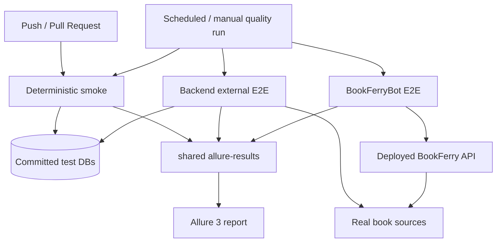

# Тестовая инженерия BookFerry

**Русский** | [English](README_tests_EN.md)

BookFerry — небольшой production-проект, поэтому нет смысла писать сотни тестов только ради их количества.

Вместо этого я построил тестовую инфраструктуру по тем же принципам, которые использовал бы в значительно более крупной production-системе, сохранив объём тестов соразмерным самому проекту.

Этот репозиторий должен показывать **инженерные решения в тестировании, а не количество тестов**. Отдельный тест `GET /health -> 200 OK` добавить было бы элементарно, но здесь он почти ничего интересного не продемонстрировал бы.

При этом тесты существуют не только ради портфолио: они защищают живой сервис от регрессий, проверяют реальные внешние интеграции и совместимость с отдельно разрабатываемым Telegram-клиентом.

С учётом параметризации сейчас получается **22 тест-кейса**:

| Уровень | Кейсов | На какой вопрос отвечает |
|---|---:|---|
| Backend smoke | 10 | Не сломало ли изменение базовую работу приложения? |
| Backend external E2E | 8 | Продолжает ли BookFerry работать с реальными книжными источниками? |
| BookFerryBot E2E | 4 | Продолжает ли реальный клиент работать с развернутым сервером? |

**Живой Allure:** https://allure.heartlab.app/

**Код:** [backend smoke](https://github.com/TerentievKirill/BookFerry/tree/readme/tests/smoke) · [backend E2E](https://github.com/TerentievKirill/BookFerry/blob/readme/tests/e2e/test_external_e2e.py) · [BookFerryBot](https://github.com/TerentievKirill/BookFerryBot) · [bot E2E](https://github.com/TerentievKirill/BookFerryBot/blob/main/tests/test_external_e2e.py) · [общий workflow](../.github/workflows/allure-report.yml)

## Стратегия тестирования

Наборы тестов разделены прежде всего по тому, **что означает их падение**, а не просто по структуре директорий.

### 1. Детерминированный smoke

Smoke работает на зафиксированных SQLite-снимках тестовых данных и не зависит от доступности внешних книжных источников. Он даёт быстрый feedback на pull request в `main` и push в `main` / `testing`.

Проверяются оба актуальных клиентских API-контракта backend.

**PocketBook API**

- регистрация пользователя и получение UUID;
- чтение профиля;
- смена каталога;
- обработка неизвестного пользователя;
- локальный поиск книги через контракт с `uid`.

**Telegram compatibility API**

- ленивое создание пользователя через реальный flow настроек;
- чтение профиля;
- смена каталога;
- обработка неизвестного Telegram-пользователя;
- локальный поиск через Telegram-контракт.

Кроме этого smoke проверяет неподдерживаемые типы клиентов, независимую валидацию response-моделей и базовый бизнес-сценарий:

```text
register / create
      ↓
select catalog
      ↓
search
```

Практический вопрос у suite простой:

> Не сломало ли это изменение базовую функциональность BookFerry, которой пользуются реальные клиенты?

### 2. Backend external E2E

External E2E использует то же приложение, но после детерминированного локального поиска идёт дальше — до **реального источника EPUB**.

Для каждого встроенного каталога есть два параметризованных сценария:

1. найти известную книгу;
2. найти её и скачать реальный EPUB через BookFerry.

Проверяются четыре каталога: Project Gutenberg, The Anarchist Library, Flibusta и Библиотека Анархизма. В результате получается **8 E2E-кейсов без дублирования сценарного кода**.

Тест скачивания проверяет не только HTTP `200`:

```python
assert response.status_code == 200
assert response.headers["Content-Type"].startswith("application/epub")
assert len(response.content) > 1000
assert response.content.startswith(b"PK")
```

Этот suite намеренно вынесен из обычного PR smoke: временная недоступность стороннего сервиса не должна выглядеть как детерминированная регрессия приложения.

Исходник: [`tests/e2e/test_external_e2e.py`](e2e/test_external_e2e.py)

### 3. Cross-repository E2E

Telegram-клиент находится в отдельном репозитории: [BookFerryBot](https://github.com/TerentievKirill/BookFerryBot).

Его E2E-тест намеренно использует **production API client**, а не специальную тестовую обёртку:

```python
from app.api_client import download_book, search_books, update_catalog
```

Сценарий проходит по реальному интеграционному пути:

```text
BookFerryBot production API client
              ↓
       deployed BookFerry API
              ↓
          select catalog
              ↓
            search
              ↓
       real EPUB source
              ↓
     download + validate
```

Таким образом проверяется совместимость **двух репозиториев и двух независимо разворачиваемых компонентов**. Изменение backend может быть поймано с точки зрения реального клиента, а не только собственным тестовым framework сервера.

- [Bot E2E test](https://github.com/TerentievKirill/BookFerryBot/blob/main/tests/test_external_e2e.py)
- [Production API client](https://github.com/TerentievKirill/BookFerryBot/blob/main/app/api_client.py)
- [Bot E2E workflow](https://github.com/TerentievKirill/BookFerryBot/blob/main/.github/workflows/external-e2e.yml)

## Архитектура тестов



Важно не количество блоков на схеме: у каждого уровня своя граница отказа, но итоговый отчёт всё равно даёт одно место, где можно посмотреть состояние всей системы.

## Небольшой framework с понятными обязанностями

Backend test framework намеренно простой:

```text
BookFerryApi
     ↓
fixtures + reusable flows
     ↓
test scenarios
```

### API layer

`tests/framework/api.py` содержит тонкие HTTP-обёртки. Методы выполняют запросы и возвращают `requests.Response`; assertions остаются в тестах.

### Flows

`tests/framework/flows.py` содержит переиспользуемое многошаговое поведение: создание пользователя, выбор каталога, поиск книги. Одиночные HTTP-вызовы остаются в API layer.

Поэтому smoke-тест может читаться почти как пользовательский сценарий:

```python
user = flow.create_configured_pocketbook_user(catalog_id=3)
book = flow.find_first_book(uid=user.uid, query="Лабиринт отражений")

assert book.title
assert book.url
```

### Независимые response-модели

Тесты не переиспользуют Pydantic-модели приложения из `app.models`.

```python
user = User.model_validate(response.json())
```

Модели на стороне тестов независимо валидируют внешний HTTP-контракт, а не проверяют ответ той же моделью, которой он был сформирован.

### Fixtures и тестовые данные

Fixtures подготавливают состояние через публичный HTTP API, а не прямым редактированием SQLite.

Smoke использует зафиксированные снимки:

```text
bookferry_test.db  — пользователи и конфигурация каталогов
catalog_test.db    — детерминированный снимок поисковых метаданных
```

Каждый CI runner начинает с чистой копии репозитория, поэтому данные предсказуемы без мокирования самого BookFerry API.

## CI/CD и Allure

Автоматизация запуска тестов — часть тестового дизайна, а не ручной шаг после написания тестов.

### Feedback на PR

[`tests.yml`](../.github/workflows/tests.yml):

```text
checkout
   ↓
build BookFerry Docker image
   ↓
start isolated backend with test DBs
   ↓
run PocketBook + Telegram smoke
   ↓
upload allure-results
```

### Внешние проверки

[`external-e2e.yml`](../.github/workflows/external-e2e.yml) запускает backend E2E против реальных источников отдельно от детерминированного smoke.

У BookFerryBot есть и собственный [scheduled/manual E2E workflow](https://github.com/TerentievKirill/BookFerryBot/blob/main/.github/workflows/external-e2e.yml), который работает с развернутым API.

### Один отчёт для двух репозиториев

[`allure-report.yml`](../.github/workflows/allure-report.yml) checkout'ит **BookFerry и BookFerryBot**, запускает все три suite и пишет результаты в один каталог `allure-results`.

```text
BookFerry smoke
BookFerry external E2E
BookFerryBot production-client E2E
        ↓
shared allure-results
        ↓
Allure 3
        ↓
https://allure.heartlab.app/
```

Allure metadata намеренно минимальна: её достаточно для читаемого отчёта, но недостаточно, чтобы reporting-код превратился во второй test framework.

## Инженерные решения

| Решение | Почему |
|---|---|
| Не тестировать каждую ручку | Количество тестов не является целью; тривиальные проверки почти ничего не добавляют ни к этому портфолио, ни к текущей защите от регрессий |
| PocketBook + Telegram в smoke | Это реальные клиенты с разными API-контрактами поверх общей backend-логики |
| External E2E отдельно от PR smoke | Доступность сторонних сервисов не должна ломать детерминированный feedback |
| Production API client бота в E2E | Проверяется именно тот контракт, которым пользуется независимо развернутый клиент |
| Независимые Pydantic-модели | Проверка контракта не должна переиспользовать те же модели, которые сформировали ответ |
| Без прямых DB helpers | Сценарии подготавливают состояние через публичный API, как реальные клиенты |
| Без generic HTTP hierarchy / repository layer | Сложность добавляется только тогда, когда у проекта появляется реальная потребность в ней |

Главная идея всей тестовой системы: **достаточно простая, чтобы быстро разобраться, и достаточно структурированная, чтобы расти вместе с проектом**.

## Локальный запуск

```bash
# детерминированный backend smoke
pytest tests/smoke -v -s -m "not e2e"

# backend external E2E
pytest tests/e2e/test_external_e2e.py -v -s -m e2e

# все backend-тесты
pytest tests -v
```

Другой экземпляр backend можно указать так:

```bash
pytest tests -v --base-url=http://example:8000
```
